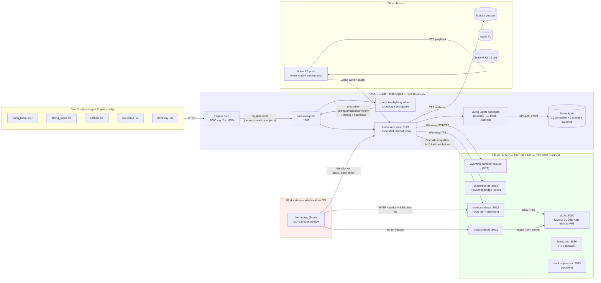
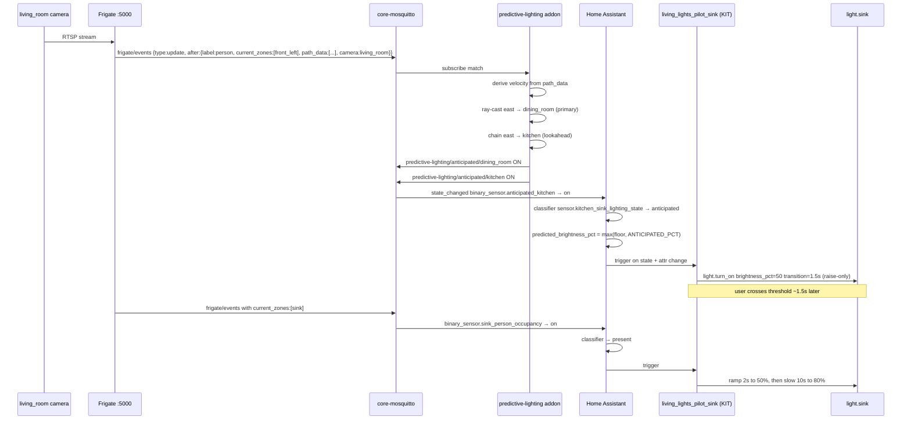
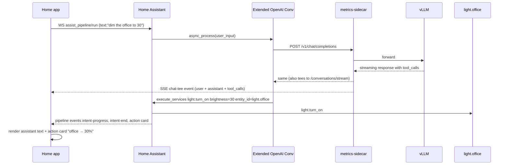

# Home / Engineered Lighting System Overview

> **Title:** Home / Engineered Lighting — system overview
> **Date:** 2026-05-26
> **Doc version:** v1
> **Audience:** human collaborators and future AI coding agents onboarding to this codebase.
> **Sources of truth:** the repository at `C:\Claude\home` and the deeper docs cross-linked in each section. When this doc and a source disagree, the source wins. See `## How to keep this doc fresh` at the bottom for the maintenance recipe.

This document is a comprehensive, navigable overview of the Home (Tauri desktop app) plus Engineered Lighting (the ambient/lighting intelligence) plus all the surrounding home infrastructure that the two depend on. It is intentionally standalone — you should be able to read this end-to-end and orient yourself to the system without needing the original conversation context.

It is also intentionally summary-grade. The deeper canonical sources remain `README.md`, `docs/ARCHITECTURE.md`, `docs/SETUP.md`, `docs/RUNBOOK.md`, `docs/TROUBLESHOOTING.md`, `stack/README.md`, and the in-tree code itself. Every section below names the source it summarizes; follow the links when you need to do more than orient.

---

## Table of contents

1. [Executive summary](#1-executive-summary)
2. [Product vision](#2-product-vision)
3. [High-level system architecture](#3-high-level-system-architecture)
4. [Hardware / compute layout](#4-hardware--compute-layout)
5. [Networking and SSH access](#5-networking-and-ssh-access)
6. [Repository directory structure](#6-repository-directory-structure)
7. [Markdown / documentation files](#7-markdown--documentation-files)
8. [Home app features](#8-home-app-features)
9. [Home Assistant architecture](#9-home-assistant-architecture)
10. [Home Assistant automations](#10-home-assistant-automations)
11. [Frigate usage](#11-frigate-usage)
12. [AI / model stack](#12-ai--model-stack)
13. [Data flow and event flow](#13-data-flow-and-event-flow)
14. [Lighting system / Living Lights](#14-lighting-system--living-lights)
15. [Current known limitations](#15-current-known-limitations)
16. [How to run / develop locally](#16-how-to-run--develop-locally)
17. [Operations / maintenance](#17-operations--maintenance)
18. [Security / privacy considerations](#18-security--privacy-considerations)
19. [Roadmap / future direction](#19-roadmap--future-direction)
20. [Glossary](#20-glossary)
21. [Appendix](#21-appendix)
22. [How to keep this doc fresh](#how-to-keep-this-doc-fresh)

---

## 1. Executive summary

**Home** is a Tauri desktop app (Rust shell + React/JSX frontend) that turns a Home Assistant install into a real-time conversation surface. You type or speak to the house, Home Assistant's pipeline classifies the request, a local LLM dispatches device actions, the app streams the result back as it happens. Cameras, occupancy, audio events, and identity overlays all surface in the same feed — the app is both the chat client and the diagnostic console.

**Engineered Lighting** is the ambient-intelligence layer that runs underneath the chat surface. Five IP cameras feed Frigate; Frigate publishes person/occupancy/audio events over MQTT; a custom HAOS add-on (`predictive-lighting`) projects person trajectories into per-room "anticipated" predictions; a generated set of Home Assistant template sensors and pilot automations consume those signals to ramp lights up before someone walks into a room and ease them back down when the room empties. The lighting system is what makes the home feel awake — Home is the surface for talking to it and seeing what it's thinking.

The two pieces share infrastructure (Home Assistant, MQTT, the camera tree, identity data) but neither owns the other. You can use Home as a pure HA chat client without the lighting layer active, and you can run the lighting layer without ever opening the Home app — they meet in HA's state model.

This repo also carries a third pillar — the **AI inference stack** (`stack/`) — that runs on a separate Linux box with a Blackwell-class GPU. vLLM (Qwen3-VL-30B-A3B-Instruct-FP8) handles all LLM reasoning + vision; Parakeet handles STT; Chatterbox (primary) and Kokoro (fallback) handle TTS; a vision sidecar wraps Qwen-VL for camera-grounded reasoning; a metrics sidecar tees chat completions to Home and exposes GPU telemetry. Everything is LAN-only; no cloud dependencies at runtime.

The whole system is intentionally local-first: cameras, models, identity, conversation history — all of it stays on hardware you own. The internet is needed once to pull models, never again.

---

## 2. Product vision

Long-term, the vision is a home model that understands rooms, people, activities, and intent — and a Home app that lets the resident drive it and debug it in natural language. Concretely:

- **Natural-language control of the home.** "Turn off the kitchen lights." "Make the office cozy for reading." "Who's in the living room?" — all dispatched to real device actions via the local LLM.
- **Vision-assisted context inference.** The vision sidecar can describe what a camera sees on demand (`/look`, `/describe`); the goal is for that context to flow into routine answers ("the kitchen looks busy") and into proactive choices (auto-dim during a movie).
- **Lighting that reacts immediately to human presence.** No motion-sensor lag; cameras + zone overlap give per-second occupancy, and the pilots respond with a confidence ramp.
- **Predictive / anticipatory lighting behavior.** The kinematic anticipator projects each tracked person's velocity vector against hand-drawn room polygons + a camera-edge graph and pre-warms the room you're heading to before you cross the threshold.
- **Time-of-day-aware brightness and color temperature.** A single circadian curve (Adaptive Lighting) handles color from 2000 K warm at night to 4000 K neutral at midday; the brightness layer (Living Lights) bakes a vacant-baseline schedule (50 % during the day, 20 % overnight, 8 % during a movie).
- **Pass-through vs lingering vs anticipated vs vacant.** The room classifier distinguishes between someone crossing a zone (`pass_through`), settling into it (`present`), expected-soon (`anticipated`), and gone (`vacant`). Each gets a different brightness response.
- **Debugging and observability through the Home app.** Metrics drawer with GPU + VRAM + CPU + RAM lines, a time-aligned voice-call profiler (Lab tab), per-room "world state" inspector, routing-log paste-back. The home is debuggable from the same UI you control it with.
- **A future where the home model is unified.** The repo carries scaffolds for a belief engine (`living_lights_belief_engine.yaml`), a learning loop (`living_lights_learning.yaml`), and V-JEPA-2 activity hooks (`ACTIVITY_PROFILES` in the lighting generator) — all default-off but ready to switch on when V-JEPA-2 ships locally.

The "Home" / "Engineered Lighting" distinction in product terms:
- **Home** is the app + the agent + the conversation surface. It's how you talk to your house.
- **Engineered Lighting** is the lighting/ambient stack — the cameras, Frigate, the predictive-lighting addon, Adaptive Lighting, Living Lights packages, the gradient layer, the kinematic anticipator. It's what makes the house feel awake.

You can use either without the other, but both together is the destination.

---

## 3. High-level system architecture

Three independent layers, all running on hardware in your home, talking over LAN or Tailscale.



**Three trust boundaries**, all enforced by network + bearer tokens:

1. **Home app ↔ HA** — over WebSocket, authenticated by an HA Long-Lived Access Token stored in the app's localStorage / Tauri config.
2. **HA ↔ Ubuntu AI box** — over LAN HTTP / Wyoming protocol; `HA_TOKEN` is shared with the vision-sidecar and the metrics-sidecar so they can call back into HA's `camera_proxy` endpoint. vLLM, Parakeet, Kokoro, Chatterbox are unauthenticated by design (LAN-only).
3. **Stack supervisor ↔ Home app** — bearer token (`STACK_TOKEN`) on the supervisor's mutate endpoints. Liveness probe is unauthenticated.

For the full design rationale see [`docs/ARCHITECTURE.md`](ARCHITECTURE.md).

---

## 4. Hardware / compute layout

### 4a. HAOS LattePanda Sigma box (192.168.0.125)

The "always-on home brain." Anchors every household state.

- **Home Assistant OS** — main HA install. Custom components include `extended_openai_conversation` (vendored under `ha-config/extended_openai_conversation/`). HA REST/WebSocket on :8123.
- **Frigate NVR add-on** — :5000 web UI + :8554 go2rtc RTSP restream. Detector: **Coral EdgeTPU (PCI)** per `ha-config/frigate-config.yaml.example`. Decoder: Intel iGPU (VAAPI). Five cameras, full zone definitions, semantic search, audio events (10 sound classes), face recognition all enabled.
- **MQTT broker** — `core-mosquitto` add-on, port :1883, user `frigate` (also used by the predictive-lighting addon). Every cross-process signal in this house flows through MQTT.
- **`predictive-lighting` custom add-on** — `addons/predictive-lighting/`. Two responsibilities sharing one MQTT subscription: a zone-transition logger (cold storage / ground truth) and the kinematic anticipator (live predictions). Persists to `/share/predictive-lighting/`. Heartbeat every 60 s on `predictive-lighting/eval/heartbeat`. See [§14](#14-lighting-system--living-lights) for behavior.
- **HA packages directory** (`ha-config/packages/`) - 25 YAML files, including the generated observability classifier, 10 generated pilot automations (one per light-targeting zone), Adaptive Lighting config, Frigate stats, manual override detection, override lifecycle, away sweep, good-morning scene support, gradient lighting, ambient switches, shadow-mode decision logger, belief-engine scaffold, learning-loop scaffold, eval-heartbeat watchdog, the anticipated kill switch, and Travel Mode enforcement.
- **Voice integrations** — HA Assist pipelines, Voice PE pairing.
- **Smart-home integrations (likely Zigbee/Wi-Fi/Hue) — see "Unknowns" below.**

> **Unknown / needs confirmation:** the exact Zigbee/Matter integration in use (Zigbee2MQTT vs ZHA vs Hue Hub vs Matter). The repo doesn't ship `configuration.yaml` (it lives on the HAOS host at `/config/configuration.yaml`); the light entities targeted by Living Lights (`light.front_left`, `light.dining_table_left`, `light.sink`, etc.) imply a Hue or similar integration but the binding is set on HAOS, not in the repo.

### 4b. Ubuntu AI box — 192.168.0.100, hostname `EngineeredLightingServer1`, alias `hav-ubuntu`

The "AI compute" — all heavy inference + media servers, none of which run on HAOS.

- **RTX 6000 Blackwell** GPU (96 GB VRAM). Some images required a custom Blackwell rebuild (cu128 + Torch 2.7) — see `stack/services/vllm-blackwell/` and `stack/services/tts/Dockerfile.kokoro-blackwell`.
- **Docker Compose stack** at `/opt/home/stack/` (or wherever the repo is checked out). Brought up via `bash scripts/stack.sh up`. Containers as of today:
  - `hav-vllm` — vLLM serving `Qwen3-VL-30B-A3B-Instruct-FP8` at `qwen3-vl-30b` served-model-name. Tool-call parser `hermes`. Internal-only — proxied through metrics-sidecar.
  - `hav-wyoming-parakeet` — STT, Wyoming protocol, :10300.
  - `hav-kokoro-tts` — TTS engine :8880 (OpenAI-compatible).
  - `hav-chatterbox-tts` — TTS engine :8881 (devnen Chatterbox, BF16). Primary TTS for the bridge; voice = `Gianna.wav`.
  - `hav-wyoming-kokoro` — Wyoming bridge :10301 that fronts whichever OpenAI-compatible TTS is active (currently Chatterbox).
  - `hav-vision-sidecar` — :8091, FastAPI Qwen3-VL orchestrator for `/describe`, `/describe_clip`, `/reason`, `/reason_zoom`.
  - `hav-metrics-sidecar` — :8092, telemetry + chat-tee SSE; also acts as the LLM proxy on :8000 (HA's Extended OpenAI Conv talks here, not directly to vLLM).
  - `hav-intelligence` — :8094 inside the container, published as :8095 by default; read-only long-horizon memory, lighting evidence, and preference-candidate aggregation for the Home Intelligence tab.
  - Behind the `s2s` profile (off by default): `hav-s2s-model`, `hav-personaplex-bridge` — full-duplex speech-to-speech experiment. Moshi listener and PersonaPlex bridge retired as of May 2026 but the code remains.
- **stack-supervisor** systemd unit (`hav-stack-supervisor.service`, :8093) — HTTP control plane the Home app uses to start/stop/restart the stack. Not in docker-compose so it survives `stack.sh down`. See `docs/RUNBOOK.md` for `STACK_TOKEN` setup.
- **GPU utilization observation point**: `nvidia-smi`, or `curl http://192.168.0.100:8092/metrics | jq` for the structured snapshot used by the Home app.

The default `docker compose up -d` brings up 8 default Docker Compose services: vLLM, Parakeet, Kokoro, Chatterbox, wyoming-kokoro, vision-sidecar, metrics-sidecar, and intelligence. The `s2s` profile adds 2 `s2s` profile services. ~40 GB VRAM resident at idle, leaving ~56 GB headroom for V-JEPA-2 or extra experiments.

### 4c. Other devices

- **IP cameras** — five of them, all reolink-style, RTSP-only, credentials shared (see `ha-config/frigate-config.yaml.example` for the full URLs).
- **Sonos speakers** — at LAN .145, .146, .194. HA's TTS output target.
- **Voice PE puck** — Home Assistant Voice Preview Edition. Wake-word + ambient mic. Paired through HA's Voice Assistants UI.
- **Apple TV** — controlled via the `media_player.living_room_2` HA entity in some legacy paths; **LG TV** (`media_player.lg_tv`) is the current "is a movie playing" sentinel.
- **JetKVMs** at LAN .17 and .66 — hardware KVM for the Ubuntu AI box and HAOS box, accessed via `https://app.jetkvm.com/`. Useful when one of the boxes is unreachable from the LAN.
- **ESP32 / custom bulbs** — none deployed currently. Marked as a Roadmap item.
- **Coral EdgeTPU** — present (referenced in Frigate config as `detectors.coral.type: edgetpu`). Plugs into HAOS box.
- **Smart switches** — two ambient switches (`switch.ambient_light_left_mss110_main_channel`, `switch.ambient_light_right_mss110_main_channel`, both Meross MSS110). Outdoor light `light.outdoor_light` is on the Adaptive Lighting curve but not the Living Lights occupancy graph.

---

## 5. Networking and SSH access

All operational hosts are on the same `/24` LAN; a Tailscale tailnet links the Home app's workstation when out-of-home.

### 5a. HAOS box

| Attribute       | Value                                                                                       |
|-----------------|---------------------------------------------------------------------------------------------|
| Hostname        | `homeassistant.local`                                                                       |
| LAN IPv4        | `192.168.0.125`                                                                             |
| HA API port     | `:8123` (use the LAN IP — `localhost:8123` does **not** work from inside the HAOS host shell) |
| Frigate UI      | `http://192.168.0.125:5000/`                                                                |
| MQTT broker     | `192.168.0.125:1883` (user `frigate`, password in `secrets`)                                |
| SSH (admin)     | `ssh -p 22222 root@192.168.0.125` (custom port via the `Advanced SSH & Web Terminal` add-on) |
| Tailscale       | Same hostname over the tailnet when present                                                  |

**Troubleshooting notes (HAOS):**
- API calls from inside the HAOS host shell must use `http://192.168.0.125:8123` — `localhost:8123` returns connect errors because HA listens on the LAN interface, not loopback inside the host namespace.
- Long-lived HA token convention: user-sanctioned path is `/tmp/ha_token.txt` on HAOS for tooling that needs it (e.g., the eval-logger thread inside the predictive-lighting addon).
- `ha core check` validates YAML before a restart.
- `ha addons logs local_predictive_lighting` is the canonical predictive-lighting log tail.
- If `ha addons update <name>` says "no update available" but you changed `config.yaml`'s `version`, the supervisor manifest cache is stuck — use `ha addons rebuild <name>` instead.
- Restarting HA core via Supervisor API bypasses the queued-job deadlock that occasionally hits `homeassistant.restart` — see [`docs/RUNBOOK.md`](RUNBOOK.md#home-assistant-operations).

### 5b. Ubuntu AI box

| Attribute       | Value                                                                                    |
|-----------------|------------------------------------------------------------------------------------------|
| Hostname        | `EngineeredLightingServer1`, SSH alias `hav-ubuntu`                                      |
| LAN IPv4        | `192.168.0.100`                                                                          |
| SSH             | `ssh hav-ubuntu` (alias in `~/.ssh/config` on the workstation)                           |
| Stack home      | `/opt/home/` (the repo is cloned here)                                                   |
| Compose context | `/opt/home/stack/`                                                                       |
| LLM proxy port  | `http://192.168.0.100:8000` (metrics-sidecar fronts vLLM)                                |
| Metrics port    | `http://192.168.0.100:8092`                                                              |
| Vision sidecar  | `http://192.168.0.100:8091`                                                              |
| Supervisor      | `http://192.168.0.100:8093` (`/healthz` unauthenticated; `/api/stack/*` needs `STACK_TOKEN`) |

**Troubleshooting notes (Ubuntu AI box):**
- `nvidia-smi` is the first stop when latency is bad.
- `docker compose ps` (in `/opt/home/stack`) shows live container state; `bash scripts/stack.sh status` is the friendlier wrapper.
- vLLM startup downloads ~30 GB on a fresh `hf_cache` volume; first boot is 10–30 min.
- Blackwell sm_120 isn't supported by stock vLLM/Kokoro images — use the cu128 Blackwell rebuilds in `stack/services/vllm-blackwell/` and `stack/services/tts/Dockerfile.kokoro-blackwell`.
- If HA loses contact with the AI box after enabling Tailscale subnet routing, install the `hav-lan-priority.service` systemd unit and re-verify with `ip rule list`. See [`docs/TROUBLESHOOTING.md`](TROUBLESHOOTING.md#tailscale-subnet-route-hijacks-lan).
- Workstation wrapper `scripts/stack.ps1` SSHes via the `hav-ubuntu` alias and runs the equivalent Bash script — convenient for restart/log-tail without leaving the workstation.

### 5c. JetKVM out-of-band access

`https://app.jetkvm.com/` — hardware-level KVM into both boxes (LAN .17 = Ubuntu AI box; LAN .66 = HAOS). Use when SSH is unreachable.

### 5d. Workstation (Home app host)

| Attribute   | Value |
|-------------|-------|
| OS          | Windows 11 (primary), macOS coming soon |
| App config  | `%APPDATA%\com.engineeredlighting.home\config.json` (Win) / `~/.config/home-app/config.json` (Linux/macOS, planned) |
| Logs        | `%LOCALAPPDATA%\com.engineeredlighting.home\logs\` |
| HA token    | Stored in app config — never committed to git |

---

## 6. Repository directory structure

The tree below is the repo at `C:\Claude\home` as of today. Per-area roles called out inline.

```
home/
├── README.md            # top-level README — quick-start, what-you-get summary
├── CHANGELOG.md         # v0.1.0 (2026-05-11) — initial release notes
├── SECURITY.md          # short threat model + vuln-report mailbox
├── SIMULATION_MODE.md   # design-review sandbox — runs the app without any infra
├── LICENSE / NOTICE     # MIT licensing
├── package.json         # dev-server convenience (Vite, simulation mode)
├── docs/                # operating + design docs
│   ├── ARCHITECTURE.md
│   ├── SETUP.md
│   ├── RUNBOOK.md
│   ├── TROUBLESHOOTING.md
│   ├── EXPERIMENTS-S2S.md
│   ├── SCENARIO-TESTS.md
│   ├── SCENARIO-TEST-RUN-2026-05-16.md
│   └── STABILIZATION-2026-05-16.md
├── app/                 # Tauri desktop app
│   ├── README.md
│   ├── src/             # React/JSX frontend (no bundler — Babel-standalone CDN)
│   │   ├── home-app.jsx           # main React orchestrator (332 KB)
│   │   ├── home-events.jsx        # turn-based dialogue feed
│   │   ├── home-vision.jsx        # 5-camera carousel + Frigate overlay
│   │   ├── home-control.jsx       # action cards (post-action inline UI)
│   │   ├── home-metrics.jsx       # AI/Infra tabs (telemetry sparklines)
│   │   ├── home-metrics-lab.jsx   # Lab tab (time-aligned chart + diag pane)
│   │   ├── home-people.jsx        # identity + face-rec overlay
│   │   ├── home-worldstate.jsx    # /world-state debug drawer
│   │   ├── home-explain.jsx       # "why did the assistant do this?" trace drawer
│   │   ├── home-ai-stack.jsx      # AI Stack Control card (supervisor + status)
│   │   ├── home-spatial.jsx       # /spatial light-footprint hand-draw tool
│   │   ├── home-look.jsx          # /look two-panel vision-sidecar view
│   │   ├── home-external.jsx      # /ask external reasoning fallback
│   │   ├── home-s2s.jsx           # experimental speech-to-speech client
│   │   ├── home-proactive.jsx     # proactive-assistant coordinator (greet on entry)
│   │   ├── home-stack-actions.jsx # shared supervisor REST helpers
│   │   ├── simulation*.jsx        # design-review sandbox fixtures
│   │   └── index.html             # script load order
│   └── src-tauri/                 # Rust shell (window mgmt + http plugin)
├── stack/                # AI inference stack (runs on Ubuntu AI box)
│   ├── README.md
│   ├── docker-compose.yml         # 8 default services + s2s profile (2 more)
│   ├── .env.example               # required env-var template (do not commit .env)
│   ├── scripts/stack.sh           # up/down/status/logs/restart
│   └── services/
│       ├── vllm-blackwell/Dockerfile           # cu128 + Torch 2.7 rebuild
│       ├── stt/Dockerfile.parakeet             # Wyoming Parakeet
│       ├── tts/Dockerfile.kokoro-blackwell     # Kokoro for Blackwell
│       ├── chatterbox-tts/                     # devnen Chatterbox TTS
│       ├── vision/                             # FastAPI Qwen3-VL wrapper
│       ├── metrics-sidecar/                    # NVML + psutil + Prometheus tee
│       ├── personaplex-bridge/                 # S2S bridge (retired but kept)
│       ├── s2s-model/                          # PersonaPlex / Moshi (retired)
│       ├── moshi-listener/                     # vanilla Moshi (retired)
│       ├── moshi-listener-rust/                # Rust moshi-backend (experimental)
│       └── supervisor/                         # systemd HTTP control plane
├── ha-config/            # ALL Home Assistant config that lives in the repo
│   ├── frigate-config.yaml.example   # the Frigate add-on config (5 cameras + zones)
│   ├── spatial_model.json            # hand-drawn light polygons + room edges
│   ├── homeai_proactive.yaml         # proactive coordinator automations
│   ├── homeai_proactive_test.yaml    # one-tap test harness automations
│   ├── homeai_jarvis_mute.yaml       # "Jarvis stop" composite mute
│   ├── extended_openai_conversation/ # custom integration (LLM agent + tools)
│   │   ├── conversation.py           # HA ConversationEntity subclass
│   │   ├── const.py                  # DEFAULT_PROMPT, tuning constants, ASR aliases
│   │   ├── world_state.py            # presence/identity/room aggregator
│   │   ├── external_routing.py       # /ask vs /local classifier (HA-side)
│   │   ├── frigate_sync.py           # Frigate registry → HA entity binding
│   │   ├── room_binding.py           # area/room canonicalization
│   │   ├── functions/                # 16 tool implementations
│   │   └── test_*.py                 # pytest suites
│   └── packages/                     # 25 YAML packages (Living Lights core + HA helpers)
│       ├── adaptive_lighting.yaml    # Layer 1 — color-temperature curve
│       ├── living_lights_observability.yaml   # 8-state classifier + brightness template
│       ├── living_lights_pilot_*.yaml         # 10 generated per-zone pilots
│       ├── living_lights_ambient.yaml          # ambient L/R switches
│       ├── living_lights_gradient.yaml         # per-light brightness gradient on sofa
│       ├── living_lights_shadow.yaml           # shadow-mode JSONL decision logger
│       ├── living_lights_belief_engine.yaml    # perception event normalizer (scaffold)
│       ├── living_lights_learning.yaml         # preference deviation capture (scaffold)
│       ├── living_lights_anticipated_killswitch.yaml  # one-toggle anticipation kill
│       ├── living_lights_travel_mode.yaml          # travel lock force-off enforcement
│       └── eval_anticipator_heartbeat.yaml     # Phase-2 eval harness watchdog
├── addons/
│   └── predictive-lighting/   # custom HAOS add-on
│       ├── app.py             # MQTT subscriber, MQTT publisher, LWT, heartbeat
│       ├── anticipate.py      # kinematic anticipator (velocity + ray cast + chain)
│       ├── zonelog.py         # zone-transition logger (cold storage)
│       ├── eval_logger.py     # Phase-2 eval logger (HA WS subscriber)
│       ├── config.yaml        # add-on manifest (version 0.4.1)
│       └── Dockerfile         # paho-mqtt + websocket-client base
├── predictor/             # legacy Markov predictor — retired, kept on disk
├── tools/                 # workstation-side scripts
│   ├── build-living-lights-yaml.py        # classifier + brightness template generator
│   ├── build-living-lights-actuators.py   # pilot YAML generator (one per zone)
│   ├── build-gradient-lighting.py         # gradient YAML generator
│   ├── init-spatial-model.py              # blank-model scaffolding from HA + Frigate
│   ├── eval_anticipator.py                # offline analyzer for Phase-2 harness
│   ├── test_eval_anticipator.py           # fixture-based assertions on the analyzer
│   ├── diagnose_walks.py                  # per-walk timeline diagnostic
│   ├── analyze-routing.py                 # external_routing.log corpus analyzer
│   ├── diagnose-identity.py               # V/D/W diagnostic harness (massive)
│   ├── run-production-qa.py               # smoke + service probes
│   ├── routing-corpus-tap.py              # workstation SSE chat-tee tap
│   ├── reports/                            # dated reports (.md) from each iteration
│   ├── frigate-bench/                      # frigate perf experiments
│   └── m3-workspace/                       # prompt A/B test workspace
└── .claude/worktrees/     # local agent worktrees (keen-tereshkova, etc.)
```

`node_modules/` and `tmp/` exist but are not part of the system architecture.

---

## 7. Markdown / documentation files

Inventory of the in-tree markdown files. The right-hand column flags whether the doc is the canonical source (📌), a focused experiment writeup (🧪), a dated report (📰), or a worktree duplicate (🪞 — same file under `.claude/worktrees/`, ignore those for onboarding).

| Path | What it documents | Status |
|---|---|---|
| `README.md` | What the app is, what you need, quick-start | 📌 |
| `CHANGELOG.md` | v0.1.0 (2026-05-11) initial release notes | 📌 (may lag actual releases) |
| `SECURITY.md` | Threat model + vuln-report mailbox | 📌 |
| `SIMULATION_MODE.md` | How to run the app with all live infra mocked | 📌 |
| `docs/ARCHITECTURE.md` | Three-layer architecture + per-component rationale | 📌 |
| `docs/ARCHITECTURE_DECISIONS.md` | Release-facing ADR trail for major model, voice, and lighting pivots | 📌 |
| `docs/SETUP.md` | From-zero installation walkthrough (1–2 h) | 📌 |
| `docs/RUNBOOK.md` | Operating procedures (stack up/down, supervisor, recovery) | 📌 (the most complete) |
| `docs/TROUBLESHOOTING.md` | Failure modes + fixes encountered while building | 📌 |
| `docs/EXPERIMENTS-S2S.md` | Speech-to-speech (Moshi/PersonaPlex) Phase 1.5 → 2.6 history | 🧪 |
| `docs/SCENARIO-TESTS.md` | UI scenario test catalog | 🧪 |
| `docs/SCENARIO-TEST-RUN-2026-05-16.md` | Snapshot of one scenario-test run | 📰 |
| `docs/STABILIZATION-2026-05-16.md` | Stabilization pass writeup | 📰 |
| `app/README.md` | App-specific dev notes | 📌 |
| `stack/README.md` | Stack-specific dev notes (also documents docker layer) | 📌 |
| `tools/reports/*.md` (~20 files) | Per-iteration reports (probe cycles, latency studies, handoffs) | 📰 |
| `tools/world_state_prompt_addition.md` | World-state tool prompt addendum | 🧪 |
| `tools/m3-workspace/ab-*.md` | Prompt A/B test reports | 🧪 |
| `tools/frigate-bench/REPORT.md`, `FINDINGS.md` | Frigate perf benchmarking | 🧪 |
| `tools/diagnose-report.md` | Most recent diagnose-identity.py output | 📰 |
| `app/src/simulation/cameras/README.md` | Notes on the mocked camera fixtures | 🧪 |
| `app/.claude/worktrees/**/*.md` | Branch-local copies of the above | 🪞 |
| `node_modules/**/*.md` | Third-party | 🪞 |

**Documentation inventory status:**

Source-derived inventories now covered by generated QA evidence:
- The `predictive-lighting` add-on's MQTT topic schema is source-derived in [`docs/qa/home-app-feature-audit.md#predictive-lighting-mqtt-topics`](qa/home-app-feature-audit.md#predictive-lighting-mqtt-topics); the current add-on exposes 5 predictive-lighting MQTT publish topic families and 3 predictive-lighting MQTT subscription topic families.
- The local `spatial_model.json` schema/inventory is source-derived in [`docs/qa/home-app-feature-audit.md#spatial-model-schema`](qa/home-app-feature-audit.md#spatial-model-schema); the current repo copy is schema 2 with 4 spatial model cameras and 16 spatial model lights. `camera_edges` and `zone_to_room` are absent from the local repo copy and still require deployed-copy re-sync for anticipator lookahead and zone-to-room normalization.
- The Extended OpenAI Conversation tool catalog is source-derived in [`docs/qa/home-app-feature-audit.md#extended-openai-agent-tools`](qa/home-app-feature-audit.md#extended-openai-agent-tools); the current backend registry exposes 23 Extended OpenAI agent tools from `DEFAULT_CONF_FUNCTION_TOOLS`.
- The stack-supervisor endpoint reference is source-derived in [`docs/qa/home-app-feature-audit.md#stack-supervisor-endpoints`](qa/home-app-feature-audit.md#stack-supervisor-endpoints); the current supervisor exposes 12 stack-supervisor endpoints, with `/healthz` unauthenticated and every `/api/*` route bearer-token gated by `STACK_TOKEN`.
- The major architecture-decision trail is source-linked in [`docs/ARCHITECTURE_DECISIONS.md`](ARCHITECTURE_DECISIONS.md), covering the Markov -> kinematic anticipator, PersonaPlex/Moshi -> split voice stack, Chatterbox/Kokoro TTS, and Qwen3-VL model-size pivots.

Remaining documentation gaps:
- _None known in the local documentation inventory. Live/deployed-state deltas remain tracked as RC blockers and residual risks below._

---

## 8. Home app features

The Tauri app is a single-window React UI; every feature is a JSX component in `app/src/`. The shell window default is 420×720 with `data-tauri-drag-region`-based dragging.

Frontend runtime scripts loaded before the app boot chain:

| Runtime script | Role |
|---|---|
| `https://unpkg.com/react@18.3.1/umd/react.development.js` | React runtime for the JSX component tree |
| `https://unpkg.com/react-dom@18.3.1/umd/react-dom.development.js` | ReactDOM root/mount runtime |
| `https://unpkg.com/@babel/standalone@7.29.0/babel.min.js` | In-browser JSX transform used by the sequential boot loader |

| Feature | File | Status | Depends on |
|---|---|---|---|
| Chat feed (turn-based) | `home-events.jsx` | Shipped | HA WS, chat-tee SSE |
| Camera carousel (5 cams) | `home-vision.jsx` | Shipped | HA `/api/camera_proxy/<entity>` |
| Frigate occupancy overlay | `home-vision.jsx` | Shipped | `binary_sensor.{cam}_{label}_occupancy` |
| Intent-progress card | `home-control.jsx` | Shipped | HA pipeline event stream |
| Action cards (per `call_service`) | `home-control.jsx` | Shipped | HA pipeline events |
| Voice mode (mic → STT → TTS) | `home-app.jsx` + `home-s2s.jsx` | Shipped | HA Assist pipeline OR S2S bridge |
| ASR alias correction | `home-app.jsx:30–48` | Shipped | mirrors HA-side `PERSON_NAME_ALIASES` |
| AI Stack Control card | `home-ai-stack.jsx` + `home-stack-actions.jsx` | Shipped | stack-supervisor :8093 |
| Metrics tray — `ai` tab | `home-metrics.jsx` | Shipped | metrics-sidecar `/metrics` |
| Metrics tray — `infra` tab | `home-metrics.jsx` | Shipped | metrics-sidecar |
| Metrics tray — `lab` tab (alpha) | `home-metrics-lab.jsx` | Alpha | shared 750ms metrics poll + chat-tee SSE traces |
| World-state inspector (`/world-state`) | `home-worldstate.jsx` | Shipped | HA REST `/api/extended_openai_conversation/world_state` |
| Tool-call trace drawer (`/explain`) | `home-explain.jsx` | Shipped | HA pipeline events |
| `/spatial` light-footprint draw tool | `home-spatial.jsx` | Shipped | HA POST `/api/extended_openai_conversation/spatial_model` |
| `/look <cam> <q>` two-panel vision | `home-look.jsx` | Shipped | vision-sidecar `/reason` :8091 |
| `/ask` external reasoning fallback | `home-external.jsx` | Shipped | OpenAI API (key stored in localStorage `hg-external-token-DEV`) |
| Proactive coordinator (arrival, room-entry) | `home-proactive.jsx` | Shipped | HA bus events + Voice PE `assist_satellite` |
| Routing visibility (`/debug on`, `/route-log`) | `home-app.jsx` slash dispatch | Shipped | HA event `extended_openai_conversation.routing_decision` + REST `/routing_log` |
| Jarvis mute (`/mute`, `/unmute`) | `home-app.jsx` slash dispatch | Shipped | `binary_sensor.jarvis_muted_effective_v2` + composite gates |
| Simulation mode (`/simulation`) | `simulation*.jsx` | Shipped | none — fully self-contained |
| Theme toggle (paper-terminal / dark) | `home-app.jsx` | Shipped | none |
| Conversation history persistence | `home-app.jsx` | Shipped | browser `localStorage` |
| Authentication / remote access | `home-app.jsx` | Shipped | HA Long-Lived Access Token (LLAT) stored in localStorage / Tauri config; remote access assumes Tailscale or LAN — **no SSO** |

### 8a. Slash-command inventory

The authoritative command surface is the `handleCommand` switch in `home-app.jsx`. Current commands:

`/3d`, `/about`, `/agent-tools`, `/apartment`, `/ask`, `/cameras`, `/cams`, `/clear`, `/clip`, `/clips`, `/connect`, `/debug`, `/demo`, `/describe-clip`, `/endpoint`, `/external`, `/find`, `/find-clips`, `/help`, `/lab-dump`, `/lab-dump-watch`, `/labeler`, `/lights`, `/local`, `/look`, `/metrics`, `/model`, `/mute`, `/proactive`, `/recap`, `/route`, `/route-log`, `/routes`, `/s2s`, `/sim`, `/simulation`, `/spatial`, `/stack-token`, `/stacktoken`, `/test`, `/token`, `/tools`, `/unmute`, `/version`, `/vl`, `/voice`, `/voices`, `/why`, `/why-light`, `/world`, `/world-state`.

### 8b. Simulation Mode scenario inventory

The authoritative Simulation Mode scenario registry is `app/src/simulation-data.jsx`. Current scenario IDs:

`action-card-error`, `action-card-expired`, `action-failed`, `action-success`, `ai-stack-error`, `ai-stack-starting`, `arrival-pending`, `arrival-unconfirmed`, `arrived-home`, `bridge-offline`, `camera-offline`, `empty`, `everything-offline`, `external-answer`, `external-confirmation`, `external-failure`, `external-streaming`, `external-unavailable`, `frigate-face-offline`, `frigate-offline`, `haos-offline`, `healthy`, `high-vram`, `left-home`, `light-control`, `light-group-control`, `listening`, `low-confidence-face`, `marcelo-in-kitchen`, `marcelo-in-office`, `media-control`, `media-group-control`, `media-unavailable`, `metrics-timeline-healthy`, `metrics-timeline-high-vram`, `metrics-timeline-history`, `metrics-timeline-no-data`, `metrics-timeline-slow-llm`, `metrics-timeline-stt-cpu-spike`, `metrics-timeline-tts-slow`, `mixed-query`, `model-offline`, `model-warming`, `movie-mode`, `multiple-people`, `network-degraded`, `network-healthy`, `perception-auto-trigger-on-occupancy`, `perception-multi-room-thumbnails`, `perception-storm-debounced`, `person-unknown-living-room`, `proactive-timeout`, `room-entry-cooldown`, `room-entry-kitchen`, `room-entry-suppressed`, `slow-voice`, `spatial-calibration`, `speaking`, `stale-identity`, `thinking`, `tts-offline`, `welcome-home-followup`.

### 8c. Boot-loader module inventory

The authoritative frontend load graph is the `files = [...]` array in `app/src/index.html`. Each file below is loaded on first paint in this order; helper modules are listed because they own state contracts and failure behavior even when they do not render a full panel.

| Module | Role / feature surface | Integrations, state, or flags | Local evidence |
|---|---|---|---|
| `home-tauri.jsx` | Tauri runtime bridge, HTTP selection, persisted prefs/events, window controls | Tauri HTTP/window plugins, browser fallback, Simulation Mode fetch guard | `tools/run-tauri-glue-tests.js` |
| `home-ha.jsx` | HA WebSocket client and service-call helper | HA URL/token, `get_states`, `state_changed`, `assist_pipeline/run`, `call_service` | `tools/run-ha-client-tests.js` |
| `home-icons.jsx` | Shared icon primitives and symbols | Local UI only | `tools/check-jsx.js` |
| `home-events.jsx` | Chat feed renderer for user/home/external/system/tool/action/perception events | Conversation events, action cards, perception thumbnails, explain markers | `tools/run-events-tests.js` |
| `home-script.jsx` | Scripted demo conversation and deterministic fallback replies | Demo mode, local event playback | `tools/run-bootstrap-tests.js` plus JSX parse |
| `home-vision.jsx` | Camera carousel, stream signing, occupied-camera hints | HA camera proxy, Frigate occupancy labels, Simulation Mode stream bypass | `tools/run-vision-tests.js` |
| `home-s2s.jsx` | Speech-to-speech bridge client and voice-mode runtime | S2S bridge URL/token, mic/analyser lifecycle, Simulation Mode no-live-call guard | `tools/run-s2s-tests.js` |
| `home-metrics.jsx` | AI/infra/room dependency tray and telemetry cards | metrics-sidecar, capability health, GPU/CPU/RAM/latency telemetry | `tools/run-metrics-tests.js` |
| `home-control.jsx` | Inline light/media/action controls after assistant turns | HA `call_service`, Simulation Mode controls, media/light capability parsing | `tools/run-control-card-tests.js` |
| `home-proactive.jsx` | Proactive coordinator UI/event policy | HA bus events, arrival/room-entry state, suppression/cooldown flags | `tools/run-proactive-tests.js` |
| `home-sse-fetch.js` | SSE-over-fetch helper used by stack log streams | Auth headers, chunk parsing, abort/error closeout | `tools/run-sse-fetch-tests.js` |
| `home-stack-actions.jsx` | Shared AI stack supervisor REST client | stack-supervisor URLs, `STACK_TOKEN`, confirm headers, task ids | `tools/run-stack-actions-tests.js` |
| `home-ai-stack.jsx` | Compact AI Stack recovery/control card | supervisor status/log streams, token/auth/rate-limit/status errors, start/restart/free-GPU actions | `tools/run-ai-stack-card-tests.js` |
| `home-capabilities.js` | User-facing capability registry and header chip summarizer | Derived from service health: chat, voice, vision, Frigate/perception | `tools/run-capabilities-tests.js` |
| `home-metrics-lab-helpers.js` | Lab trace helper functions | chat-tee traces, latency timelines, history/dedup helpers | `tools/run-lab-tests.js` |
| `home-metrics-lab.jsx` | Lab tab for trace timelines and model/stack controls | metrics-sidecar SSE/history, AI Stack actions, recovery states | `tools/run-lab-tests.js` |
| `home-people-helpers.js` | People overlay layout/data helpers | identity lists, face snapshots, radial layout | `tools/run-people-tests.js` |
| `home-people.jsx` | People/identity overlay | Extended OpenAI identity APIs, Frigate face data, Simulation Mode people fixtures | `tools/run-people-tests.js` |
| `home-explain-helpers.js` | Explain drawer pure helpers | routing/tool/perception/confirmation event partitioning and timelines | `tools/run-explain-tests.js` |
| `home-explain.jsx` | "Why did it do that?" drawer | HA routing log and tool-call events | `tools/run-explain-tests.js` |
| `home-worldstate-helpers.js` | World-state formatting/sorting/countdown helpers | room/person freshness, auto-refresh countdown | `tools/run-worldstate-tests.js` |
| `home-worldstate.jsx` | `/world-state` drawer with room filter and auto-refresh | HA `/world_state`, Simulation Mode fixture, tab-visibility pause | `tools/run-worldstate-tests.js` |
| `home-spatial-helpers.js` | Spatial model helper functions | room/zone geometry and helper exports | `tools/run-apartment-data-tests.js` plus JSX parse |
| `home-spatial.jsx` | `/spatial` light-footprint drawing tool | HA spatial model endpoint, 3D apartment context | `tools/run-apartment-data-tests.js` plus JSX parse |
| `home-look.jsx` | `/look` two-panel visual reasoning view | vision-sidecar `/reason`, camera/entity prefix parsing, sidecar base URL | `tools/run-look-tests.js` |
| `home-external.jsx` | `/ask`, `/local`, `/route`, and external reasoning UI | external API key, privacy payload, route explanation, Simulation Mode guard | `tools/run-external-tests.js` |
| `home-lighting-events.jsx` | Living Lights manual override/articulation event subscriber | HA bus events `living_lights_override_detected` and `living_lights_articulation` | `tools/run-lighting-events-tests.js` |
| `home-lights.jsx` | `/lights` Living Lights cascade drawer | HA entities for sleep/asleep, night-safe, bias, ToD, gaming, movie, zone scope | `tools/run-lights-drawer-tests.js` |
| `home-intelligence.jsx` | Home Intelligence read-only review tab | intelligence sidecar, preference candidates, blockers, lighting evidence summaries | `tools/run-intelligence-tests.js` |
| `simulation-cameras.jsx` | Simulation camera fixtures and placeholder rendering | no live camera calls; private URL/entity privacy checks | `tools/run-simulation-camera-tests.js` |
| `simulation-controls.jsx` | Simulation Mode mock HA control store | mock light/media states, subscribers, media groups, reset fidelity | `tools/run-simulation-control-tests.js` |
| `simulation-timeline.jsx` | Simulation timeline/event scheduler | scenario timeline cancellation and event injection | `tools/run-simulation-command-tests.js` |
| `simulation-data.jsx` | Simulation scenario registry and fixtures | 62 scenario ids, outage labels, explain/world-state/spatial/camera/clip fixtures | `tools/run-simulation-scenario-tests.js` |
| `simulation.jsx` | Simulation Mode runtime and slash command surface | `/simulation`, `/sim`, browser URL boot, session-only persistence | `tools/run-simulation-command-tests.js` |
| `home-apartment-data.js` | `/apartment` data layer | model load/save/cache/draft/seed priority, HA registry palette, tracker WebSocket | `tools/run-apartment-data-tests.js` |
| `home-apartment-sim.js` | `/apartment` Simulation Mode tracks and fixtures | sim tracks, no live tracker dependency | `tools/run-apartment-data-tests.js` |
| `home-apartment-cards.jsx` | Apartment info/control cards | apartment state summaries and card rendering | `tools/run-apartment-data-tests.js` plus JSX parse |
| `home-apartment-calibrate.jsx` | Camera calibration overlay | Frigate snapshots, 2D/3D point pairing, tracker base URL | `tools/run-apartment-data-tests.js` plus JSX parse |
| `home-apartment-edit.jsx` | Apartment edit/drawing tools | model geometry, undo/redo, save flow | `tools/run-apartment-data-tests.js` plus JSX parse |
| `home-apartment.jsx` | `/apartment` 3D apartment surface | Three.js engine bridge, HA state binding, spatial tracker, calibration/edit overlays | `tools/run-apartment-data-tests.js` |
| `home-video-labeler-data.js` | Video-labeler API/data layer | video-labeler service, drafts, media URLs, ontology axes, Simulation Mode guard | `tools/run-video-labeler-data-tests.js` |
| `home-video-labeler-timeline.jsx` | Video-labeler timeline editor | segment math, drag snapshots, lane rendering | `tools/run-video-labeler-data-tests.js` plus JSX parse |
| `home-video-labeler.jsx` | `/labeler`/`/vl` video-labeling surface | video-labeler service, import/manual flows, timeline, drafts | `tools/run-video-labeler-data-tests.js` |
| `home-app.jsx` | Main app shell, slash-command dispatcher, state orchestration | HA connection, metrics/vision/supervisor endpoints, localStorage prefs, debug/sim flags | slash, bootstrap, AI stack, capability, and JSX suites |
| `home-mount.jsx` | React mount contract | root bootstrap, mount watchdog integration | `tools/run-bootstrap-tests.js` |

The Tauri shell is intentionally thin — just window management, a configurable HTTP plugin with `tauri.localhost` origin, and JSON config persistence. All real logic lives in React.

### 8d. Major UI surface inventory

The QA audit treats these `home-*.jsx` files as major UI surfaces because they render drawers, overlays, modals, panels, atlases, or lightboxes. The list is source-derived and must stay exact:

`home-apartment-calibrate.jsx`, `home-app.jsx`, `home-explain.jsx`, `home-external.jsx`, `home-intelligence.jsx`, `home-lights.jsx`, `home-look.jsx`, `home-metrics-lab.jsx`, `home-metrics.jsx`, `home-people.jsx`, `home-spatial.jsx`, `home-video-labeler.jsx`, `home-vision.jsx`, `home-worldstate.jsx`.

For deeper feature design notes see `docs/RUNBOOK.md` (which covers slash commands, the lab tab, the diagnostic harness, the proactive coordinator's HA-side install).

---

## 9. Home Assistant architecture

HA is the canonical home-state surface. Everything in this system either feeds HA or reads from HA.

### 9a. Custom components

- **`extended_openai_conversation/`** — forked + heavily extended from upstream. Adds: a world-state aggregator (`world_state.py`), a face/identity store (`identity_store.py`), an external-routing classifier (`external_routing.py`), 16 callable tools (`functions/`), a Frigate registry sync (`frigate_sync.py`), and a typed exceptions module (`exceptions.py`). The agent entity registers with HA's Conversation API and receives `async_process()` for every text/voice turn.
- **`Adaptive Lighting`** (HACS) — installed via HACS, configured by `ha-config/packages/adaptive_lighting.yaml`. Owns color temperature only.
- **(implied) HACS, Mosquitto broker, Frigate** — installed as add-ons on HAOS but not in the repo.

### 9b. State surfaces

- **WebSocket API** (`/api/websocket`) — primary transport for the Home app. Subscribes to `state_changed`, drives `assist_pipeline/run`, fires `subscribe_events` for `homeai_proactive`, `homeai_test`, `extended_openai_conversation.routing_decision`, etc.
- **REST API** (`/api/...`) — used by tooling and by the vision-sidecar (which calls `/api/camera_proxy/<entity>` to grab fresh JPEGs).
- **REST extensions** under `/api/extended_openai_conversation/`:
  - `world_state[?room=<name>]` — full world state JSON
  - `routing_log?tail=N` — recent routing decisions
  - `spatial_model` — POST endpoint for the `/spatial` drawer
- **MQTT** (via `core-mosquitto`) — Frigate publishes `frigate/events`, audio binary_sensors, person occupancy. The source-derived predictive-lighting topic schema is generated in [`docs/qa/home-app-feature-audit.md#predictive-lighting-mqtt-topics`](qa/home-app-feature-audit.md#predictive-lighting-mqtt-topics): 5 predictive-lighting MQTT publish topic families and 3 predictive-lighting MQTT subscription topic families.

  The predictive-lighting add-on publishes:
  - `predictive-lighting/anticipated/<room>` (retain=true, ON/OFF)
  - `predictive-lighting/availability` (LWT)
  - `predictive-lighting/eval/heartbeat` (JSON, every 60 s)
  - `predictive-lighting/debug/track/<track_id_short>` (per-event diag, not retained)
  - `homeassistant/binary_sensor/anticipated_<room>/config` (MQTT discovery)

  It subscribes to:
  - `frigate/events` (primary Frigate event stream)
  - `predictive-lighting/debug/track/+` (self-subscription for eval logging)
  - `predictive-lighting/anticipated/+` (self-subscription for eval logging)

### 9c. Areas / rooms

> **Status: best-effort token matching, not HA Areas.** Per the EntityResolver findings in `docs/EXPERIMENTS-S2S.md`, only some entities are tagged to HA Areas in the household. The agent's room concept is sourced from:
> 1. `CAMERA_TO_ROOM` in `ha-config/extended_openai_conversation/const.py` — maps camera entity_ids to room names.
> 2. `zone_to_room` in `ha-config/spatial_model.json` — maps Frigate zone names to room names when present (note: `camera_edges` and `zone_to_room` are absent from the local repo copy — the deployed copy on HAOS has the canonical mapping).
> 3. The pilot-zone slug (e.g., `sofa`, `dining_left`) → camera (e.g., `living_room`) → room.
>
> The rooms recognized: `living_room`, `dining_room`, `kitchen`, `workshop`, `driveway`.

### 9d. Helper entities used across the system

The exact source-derived `input_boolean` inventory is generated in [`docs/qa/home-app-feature-audit.md#home-assistant-input-boolean-flags`](qa/home-app-feature-audit.md#home-assistant-input-boolean-flags). The repo currently defines 51 current `input_boolean` flags across `ha-config/*.yaml` and `ha-config/packages/*.yaml`; the short list below names the helpers most often involved in runtime behavior.

- `input_boolean.user_at_home` — household presence sentinel.
- `input_boolean.homeai_sleep` — sleep mode (drives `binary_sensor.living_lights_is_night_safe`).
- `input_boolean.living_lights_enabled` / `living_lights_shadow` — master kill switches for actuation.
- `input_boolean.living_lights_travel_mode` - travel lock; blocks known lighting turn-on paths and force-turns known lights/switches off.
- `input_boolean.living_lights_zone_<slug>_enabled` (one per zone) — per-zone kill.
- `input_boolean.living_lights_anticipated_enabled` — Phase-4 kill switch (default OFF).
- `input_boolean.homeai_movie` / `homeai_dnd` / `homeai_sleep` — Jarvis-mute composite signals.
- `input_datetime.living_lights_zone_<slug>_last_manual_at` — 60-s manual cooldown gates.
- `media_player.lg_tv` — the current "is a movie playing" sentinel (chosen over `media_player.living_room_2` because the LG entity is more reliable).
- `binary_sensor.jarvis_muted_effective_v2` — composite mute computed via template.

### 9e. Home Assistant package inventory

The authoritative package source is `ha-config/packages/*.yaml`. Current packages:

`adaptive_lighting.yaml`, `eval_anticipator_heartbeat.yaml`, `frigate_stats.yaml`, `homeai_good_morning.yaml`, `living_lights_ambient.yaml`, `living_lights_anticipated_killswitch.yaml`, `living_lights_away_sweep.yaml`, `living_lights_belief_engine.yaml`, `living_lights_gradient.yaml`, `living_lights_learning.yaml`, `living_lights_manual_detection.yaml`, `living_lights_observability.yaml`, `living_lights_override_lifecycle.yaml`, `living_lights_travel_mode.yaml`, `living_lights_pilot_dining_left.yaml`, `living_lights_pilot_dining_right.yaml`, `living_lights_pilot_front_door.yaml`, `living_lights_pilot_front_left.yaml`, `living_lights_pilot_island_left.yaml`, `living_lights_pilot_island_right.yaml`, `living_lights_pilot_office.yaml`, `living_lights_pilot_sink.yaml`, `living_lights_pilot_sofa.yaml`, `living_lights_pilot_weights.yaml`, `living_lights_shadow.yaml`.

---

## 10. Home Assistant automations

Per direction, this is the full enumeration. Where multiple automations share the same generator pattern, the pattern is described once and the per-instance deltas are tabled.

### 10a. The generator pattern for pilot automations

Ten of the automations are emitted by `tools/build-living-lights-actuators.py`, one per light-controlled zone. All share the same shape:

- **alias:** `Living Lights — <slug> actuator`
- **id:** `living_lights_actuator_<slug>`
- **mode:** `restart` (interruptible — re-trigger aborts the in-progress ramp)
- **triggers:** (a) state change on `sensor.<camera>_<slug>_lighting_state`, (b) direct Frigate zone occupancy wakeups such as `binary_sensor.<zone>_person_occupancy`, (c) attribute change on `predicted_brightness_pct` of the classifier sensor, (d) `input_boolean.living_lights_asleep` flips, (e) `input_boolean.living_lights_shadow` to `"off"` for cutover, and (f) `input_boolean.living_lights_travel_mode` changes.
- **conditions:** master gates allowing actuation (`living_lights_enabled` on, `living_lights_shadow` off, `living_lights_travel_mode` off, `living_lights_zone_<slug>_enabled` on), a same-state classifier churn guard that skips no-op `present -> present` style events, and a `last_manual_at` template gate that respects manual touches while in managed states (`vacant`, `present`, `pass_through`, `asleep`).
- **actions:** an `if`/`choose` block that dispatches by classifier state (`vacant`, `away`, `presence_override`, `present`, `pass_through`, `anticipated`, `default` / `night_safe` / other); each branch ends in `light.turn_on` / `light.turn_off` against the zone's target lights. The `vacant` branch contains co-controller guards so it skips a shared light when a sibling zone is non-vacant.

The per-zone deltas:

| Zone slug | File | Camera | Light targets |
|---|---|---|---|
| `sofa` | `living_lights_pilot_sofa.yaml` | living_room | `light.front_left`, `light.front_right`, `light.rear_left`, `light.rear_right` |
| `front_left` | `living_lights_pilot_front_left.yaml` | living_room | `light.front_left` |
| `weights` | `living_lights_pilot_weights.yaml` | living_room | `light.front_right`, `light.rear_right` |
| `office` | `living_lights_pilot_office.yaml` | living_room | `light.office` |
| `front_door` | `living_lights_pilot_front_door.yaml` | living_room | `light.front_right` |
| `dining_left` | `living_lights_pilot_dining_left.yaml` | dining_room | `light.dining_table_left` |
| `dining_right` | `living_lights_pilot_dining_right.yaml` | dining_room | `light.dining_table_right` |
| `sink` | `living_lights_pilot_sink.yaml` | kitchen | `light.sink` |
| `island_left` | `living_lights_pilot_island_left.yaml` | kitchen | `light.island_left` |
| `island_right` | `living_lights_pilot_island_right.yaml` | kitchen | `light.island_right` |

### 10b. Generated automations in `living_lights_observability.yaml`

| Alias | Trigger | Conditions | Action |
|---|---|---|---|
| `Living Lights — refresh classifier + dwell on startup` | HA start; time_pattern `minutes: /5` | (none) | After a 5 s delay, `homeassistant.update_entity` against every zone's lighting-state + dwell sensors. Belt-and-suspenders against missed state on boot. |
| `Living Lights — asleep ON (house quiet overnight)` | `binary_sensor.living_lights_any_occupied → off` for `ASLEEP_IDLE_MINUTES` (15 min) | profile is `overnight`, user is home, asleep is off | Turn on `input_boolean.living_lights_asleep`. |
| `Living Lights — asleep OFF (genuinely up / midday backstop)` | any-occupied → on for `ASLEEP_WAKE_MINUTES` (10 min), OR profile transitions to `midday`, OR user-at-home → on | asleep is on | Turn off `input_boolean.living_lights_asleep`. |

### 10c. Hand-written automations in `ha-config/packages/`

| File | Alias | Trigger | Conditions | Action |
|---|---|---|---|---|
| `living_lights_ambient.yaml` | `Living Lights - ambient switches` | state-change on `media_player.lg_tv` / `user_at_home` / `living_lights_asleep` / `living_lights_travel_mode`; HA start | master toggles ON, shadow OFF, travel mode OFF | Turn OFF the two MSS110 ambient switches if TV-playing OR away OR asleep; otherwise turn ON. |
| `living_lights_shadow.yaml` | `Living Lights — log decisions on classifier transition` | state-change on any of the 15 `*_lighting_state` sensors | (none) | Build a JSONL line (from/to state + predicted + dwell + speed + last_manual_at + shadow_mode), base64-encode, append via `shell_command.living_lights_append_log` to `/config/lighting_decisions.log`. Used during shadow mode to validate before cutover. |
| `living_lights_gradient.yaml` | `Living Lights - sofa gradient actuator` | state-change on `sensor.living_room_sofa_gradient` / `input_boolean.living_lights_travel_mode` | master gates allowing actuation + `living_lights_gradient_enabled` ON + sofa state in `[present, pass_through]` + 60-s manual cooldown + 6-s rate-limit | Per-light `light.turn_on` against `front_left`, `front_right`, `rear_left`, `rear_right` at the gradient-computed pct + the classifier's color temperature. |
| `living_lights_gradient.yaml` | `Living Lights - log sofa gradient decisions` | state-change on `sensor.living_room_sofa_gradient` | (none) | Append a gradient-decision JSONL line via `shell_command.living_lights_append_log`. |
| `living_lights_travel_mode.yaml` | `Living Lights - travel mode force off` | travel mode ON; HA start; every 5 min; known light/switch turns ON | `living_lights_travel_mode` ON | Turn OFF every known lighting output in the repo inventory. |
| `living_lights_belief_engine.yaml` | `Living Lights — homeai_proactive → perception_event` | event `homeai_proactive` | (none) | Normalize event into a canonical PerceptionEvent JSON, append to `/config/perception_events.jsonl`, fire `extended_openai_conversation_living_lights_perception_event` bus event. Default-off downstream (belief updates gate on `living_lights_evidence_engine_enabled`). |
| `living_lights_belief_engine.yaml` | `Living Lights — frigate audio → perception_event` | state-change off→on on any of the 10 audio binary_sensors (`*_speech_sound`, `*_music_sound`, `*_tv_sound`, `*_doorbell_sound`, `*_knock_sound`) | (none) | Normalize as PerceptionEvent (kind=audio), append JSONL. |
| `living_lights_belief_engine.yaml` | `Living Lights — perception event log rotation` | `time at: 03:00:00`; HA start | (none) | Run `shell_command.living_lights_rotate_perception_log` (date-based rename + 30-day retention). |
| `living_lights_learning.yaml` | `Living Lights — capture preference on vacant + 5s settle` | state-change `binary_sensor.dining_left_person_occupancy` on → off for 5 s | `living_lights_learning_enabled` ON AND `living_lights_dining_left_deviation` ON | Capture actual vs predicted brightness/color-temp to `/config/lighting_preferences_pending.jsonl`; fire `living_lights_preference_pending` bus event. (Currently only the `dining_left` zone is wired; expanding to other zones is intentional incremental scaffolding.) |
| `eval_anticipator_heartbeat.yaml` | `Eval anticipator heartbeat — stalled alert` | `sensor.predictive_lighting_eval_heartbeat → unavailable` for 60 s | (none) | Fire a persistent notification: "heartbeat silent > 5 min, eval harness not collecting data, check addon logs." |
| `eval_anticipator_heartbeat.yaml` | `Eval anticipator heartbeat — recovered (clear alert)` | `sensor.predictive_lighting_eval_heartbeat` leaves `unavailable` for 30 s | (none) | Dismiss the stalled-alert notification. |

### 10d. Hand-written automations in `ha-config/homeai_*.yaml`

| File | Alias | Trigger | Conditions | Action |
|---|---|---|---|---|
| `homeai_jarvis_mute.yaml` | `Jarvis: clear movie_mode after 6h idle` | `input_boolean.homeai_movie → on` for 6h | (none) | Turn off `input_boolean.homeai_movie` (safety net so movie mode can't pin mute forever). |
| `homeai_jarvis_mute.yaml` | `Jarvis: refresh muted-effective every minute` | (every minute, time_pattern) | (none) | `update_entity` on `binary_sensor.jarvis_muted_effective` so the now-based template re-evaluates (catches timer expiry + TV grace). |
| `homeai_proactive.yaml` | `HomeAI — left home` | `person.engineeredlighting` → `not_home` (debounced) | (mode/quiet-hours gates) | Fire `homeai_proactive` bus event with `type=left`; turn off indoor lights. |
| `homeai_proactive.yaml` | `HomeAI — arrived home (stage 1)` | `person.engineeredlighting → home` for some delay | (mode/quiet-hours gates) | Fire `homeai_proactive` event with `type=arrived`, status pending. |
| `homeai_proactive.yaml` | `HomeAI - return-home lights (backstop)` | follow-on from arrival, after pending window | travel mode OFF | Call `script.homeai_return_home` to apply the return-home scene. |
| `homeai_proactive.yaml` | `HomeAI — face confirmed (stage 2)` | `sensor.<entry_camera>_last_recognized_face` matches a known face within window | (mode/quiet-hours gates) | Fire `homeai_proactive` event with `type=face_confirmed`, escalate to spoken welcome via Voice PE. |
| `homeai_proactive.yaml` | `HomeAI — room entered` | per-room occupancy `→ on` for debounce | (mode/quiet-hours gates) | Fire `homeai_proactive` event with `type=room_entry`. |
| `homeai_proactive.yaml` | `HomeAI - return-home scene` (the script) | called by other automations | travel mode OFF | Apply return-home scene to the configured indoor light list. |
| `homeai_proactive_test.yaml` | 6 `HomeAI TEST — …` automations | one `input_button` each (`homeai_test_arrival`, `homeai_test_arrival_unconfirmed`, `homeai_test_left_home`, `homeai_test_room_entry`, `homeai_test_face_confirm`, `homeai_test_run_all`) | (test gates: `test: true` payload to skip time-based rate-limits) | Fire the exact bus events the production automations fire; lets you exercise the proactive coordinator without leaving the house. Detail in [`docs/RUNBOOK.md`](RUNBOOK.md#proactive-smart-home). |

### 10e. The killswitch (no automation, but a helper)

`living_lights_anticipated_killswitch.yaml` declares `input_boolean.living_lights_anticipated_enabled` (initial OFF). Flipping it OFF makes the classifier collapse the `anticipated` state to `vacant` everywhere. No automation reads it — the classifier templates do, directly.

### 10f. Travel Mode

`living_lights_observability.yaml` declares `input_boolean.living_lights_travel_mode`, and `/lights` exposes it as the Travel Mode card. When ON, generated pilots, the gradient actuator, the CT direct-push path, ambient switches, and the HomeAI return-home scene refuse to turn known lights on. `living_lights_travel_mode.yaml` is the enforcement backstop: on HA start, every 5 minutes, and whenever a known lighting output reports `on`, it pushes those bulbs/switches back off.

### 10g. Counts

Counting every alias above: **25 unique HA automations** plus the 10 generated pilots plus 1 generated script = **36 automation-shaped pieces of YAML on disk**.

---

## 11. Frigate usage

Frigate is the canonical perception layer. Everything visual flows out of it as `frigate/events` MQTT messages or as state changes on the auto-generated HA entities (`binary_sensor.<zone>_person_occupancy`, `sensor.<camera>_avg_speed`, etc.).

### 11a. Cameras + zones

From `ha-config/frigate-config.yaml.example`. RTSP feeds restreamed via `go2rtc` so internal consumers (Frigate detect, vision sidecar) read from `rtsp://127.0.0.1:8554/<name>` instead of the upstream camera directly.

| Camera | LAN IP | Streams | Zones |
|---|---|---|---|
| `living_room` | .227 | stream1 (record+audio) / stream2 (detect) | `Front_Door`, `office`, `sofa`, `weights`, `front_left`, `Whole_Living_Room` |
| `dining_room` | .92 | same | `Dining_Left`, `Dining_Right`, `whole_dining_room` |
| `kitchen` | .64 | same | `Island_Right`, `sink`, `island_left`, `whole_kitchen` |
| `workshop` | .54 | same | `workshop_zone` |
| `driveway` | .68 | same | `e28` |

Polygon coordinates are normalized [0,1] over the 1280×720 detect substream. The `Whole_*` aggregates exist as a top-level occupancy roll-up that the zone graph and the predictive-lighting addon's `zonelog.py` know to demote when a more specific zone is also active.

### 11b. Detector + decoder

- **Detector:** Coral EdgeTPU via PCI (`detectors.coral.type: edgetpu`).
- **Decoder:** Intel iGPU VAAPI (`ffmpeg.hwaccel_args: preset-vaapi`).
- **Detect resolution:** 960×540 at 10 FPS per camera.

### 11c. Object tracking + filters

Per-camera object lists, with confidence + area filters. Indoor cameras track people + pets + household objects (cups, chairs, laptops, phones, books). The kitchen camera adds knives/forks/spoons/microwave/oven/sink. The driveway tracks vehicles + people. Per-camera `person` min_score:

- living_room — `min_score: 0.65, threshold: 0.75, min_area: 5000`
- dining_room — `min_score: 0.50, threshold: 0.60, min_area: 2000`
- (others — see `frigate-config.yaml.example`)

### 11d. Semantic search, audio, face recognition

- `semantic_search.enabled: true, model_size: small` — Frigate's CLIP-based search.
- `audio.enabled: true` with 10 listened classes: `bark, fire_alarm, scream, speech, yell, glass_breaking, doorbell, knock, baby_crying, alarm, music`. Each fires a `binary_sensor.<camera>_<class>_sound`. The belief-engine package subscribes to 10 of these.
- `face_recognition.enabled: true, model_size: small, detection_threshold: 0.7, recognition_threshold: 0.85, min_faces: 2`. Output: per-person `sensor.frigate_<person>_last_camera` + per-camera `sensor.<camera>_last_recognized_face`.

### 11e. Snapshots, record

- `record.enabled: false` — recordings are off (privacy + disk pressure).
- `snapshots.enabled: true, bounding_box: true, crop: false`.

### 11f. Frigate ↔ HA ↔ Living Lights flow

```
Frigate event (person, with current_zones)
  └─ MQTT frigate/events
     ├─ Frigate's HA integration emits binary_sensor.<zone>_person_occupancy
     │   → classifier sensor sees stable=on → state=present
     │   → pilot fires light.turn_on
     └─ predictive-lighting addon (subscribed to same topic)
         ├─ zonelog.py commits to transitions.jsonl (cold storage)
         └─ anticipate.py derives velocity + ray-casts
             → publishes predictive-lighting/anticipated/<room> ON
             → HA's auto-discovered binary_sensor.anticipated_<room> flips ON
             → classifier sees stable=off + anti_on=on → state=anticipated
             → pilot fires light.turn_on (raise-only) at ANTICIPATED_PCT
```

### 11g. Limitations of current zone definitions

- `whole_<camera>` aggregates fire on any movement in the FOV — they were added for occupancy roll-up but cause false-positive predictions if not demoted. `zonelog.py:34` lists them as `AGGREGATE_ZONES` so the most-specific sub-zone wins on commit.
- Some zone names mix capitalization (`Front_Door`, `Dining_Left` vs lowercase `sink`, `island_left`). The `zone_to_room` mapping in `spatial_model.json` normalizes them to lowercase on read.
- The polygon shapes were hand-drawn against the detect substream and tuned by walking through; they aren't independently calibrated.

### 11h. Anticipated direction — grid-based spatial model

`spatial_model.json` is the bridge between camera-space and room-space:
- **Per-camera polygons** — one polygon per light, drawn via the `/spatial` tool. Used by the gradient layer to find each light's centroid.
- **Local repo schema** — generated in [`docs/qa/home-app-feature-audit.md#spatial-model-schema`](qa/home-app-feature-audit.md#spatial-model-schema). The current copy is schema 2 with 4 spatial model cameras, 14 Frigate zones, 16 spatial model lights, 16 lights with footprint polygons, and 0 footprint-empty lights.
- **`zone_to_room`** — when present/deployed, normalizes Frigate zone names to canonical room names (`sofa → living_room`, `Dining_Left → dining_room`, etc.).
- **`camera_edges`** — when present/deployed, defines a directed graph where each camera knows which room is across its N/E/S/W edge. The anticipator uses this for ray-cast lookahead.

The deployed camera_edges form a linear chain: `driveway ← living_room ↔ dining_room ↔ kitchen → (end)`, with `workshop` isolated. This is what makes the chain-lookahead in the anticipator work cleanly.

> **Known deployed-copy delta:** `camera_edges` and `zone_to_room` are absent from the local repo copy. The deployed copy on HAOS at `/share/predictive-lighting/spatial_model.json` has the canonical values. Re-syncing the repo copy is a doc-debt item.

---

## 12. AI / model stack

All inference runs on the Ubuntu AI box. The Tauri app holds no model weights.

| Component | Type | Host | Server | Port | Purpose | Notes |
|---|---|---|---|---|---|---|
| **vLLM (Qwen3-VL-30B-A3B-Instruct-FP8)** | LLM + VLM | Ubuntu AI box | `vllm/vllm-openai:latest` + Blackwell rebuild | :8000 (internal) | All LLM reasoning, tool calls, vision-grounded chat. 30B-MoE with 3B active params per token. | Reverted from a 4B FP8 dense variant in May 2026 after the 4B couldn't reliably extract tool intents from natural utterances. Tool-call parser: `hermes`. `gpu_memory_utilization=0.70`. `--max-model-len 32768`. |
| **Wyoming Parakeet** | STT | Ubuntu AI box | `vrsttl/wyoming-parakeet-silero-wrapper` (custom build) | :10300 | NVIDIA Parakeet TDT v3 + Silero VAD wrapped in Wyoming protocol. HA's voice integration speaks Wyoming. | ~3.4 GB VRAM. |
| **Chatterbox TTS (devnen)** | TTS | Ubuntu AI box | `home-ai-voice/chatterbox-tts:blackwell` | :8881 | Primary TTS for the bridge + Home app voice mode. 350M params BF16, ~4.5 GB VRAM. Voice = `Gianna.wav`. | MIT license. Bridge falls back to Kokoro if synth fails. |
| **Kokoro TTS** | TTS | Ubuntu AI box | `home-ai-voice/kokoro-tts:blackwell` | :8880 (OpenAI-compat) | Fallback TTS engine + the HA Voice PE pipeline's TTS source. 82M params, ~1.7 GB VRAM. | Originally primary; now a fallback. |
| **Wyoming Parakeet → vLLM bridge** | — | Ubuntu AI box | `home-ai-voice/wyoming-parakeet:local` | :10300 | (above) |
| **wyoming-kokoro bridge** | TTS adapter | Ubuntu AI box | `ghcr.io/roryeckel/wyoming_openai:latest` | :10301 | Wyoming protocol ⇄ OpenAI `/v1/audio/speech`. Voice PE talks Wyoming; the bridge proxies to whichever OpenAI-compatible TTS is active (currently Chatterbox). | Container name still `wyoming-kokoro` for HA pairing stability. |
| **vision-sidecar** | API | Ubuntu AI box | FastAPI in `home-ai-voice/vision-sidecar:local` | :8091 | Pulls a fresh JPEG from HA's camera_proxy (or full-res RTSP for `/reason_zoom`), forwards to vLLM as a multimodal `image_url` message. Endpoints: `/describe`, `/describe_clip`, `/reason`, `/reason_zoom`, `/reason/latest`. | Requires `HA_TOKEN` for `camera_proxy` calls. |
| **metrics-sidecar** | API + proxy | Ubuntu AI box | FastAPI in `home-ai-voice/metrics-sidecar:local` | :8000 (chat) + :8092 (telemetry) | Proxies `/v1/chat/completions` to vLLM and tees every turn to SSE `/conversations/stream`; samples NVML + psutil + vLLM Prometheus at 500 ms cadence. | The Home app's single round-trip telemetry source. |
| **stack-supervisor** | API | Ubuntu AI box | systemd unit (`hav-stack-supervisor`) | :8093 | HTTP control plane for the AI Stack Control card: status/tasks, stack start/restart/log stream/stop/free-GPU, and per-service logs/restart/stop. | Bearer auth via `STACK_TOKEN`; mutating routes require explicit confirm headers. |
| **PersonaPlex bridge** | S2S adapter | Ubuntu AI box (off by default) | `home-ai-voice/personaplex-bridge:local` | :8094 | Adapter between the Home app's WebSocket and a Moshi-derived S2S model server. Retains text-channel intent extraction + HA dispatch path. | Behind the `s2s` Docker Compose profile. **Moshi listener retired May 2026** but the bridge is still running for chitchat/confirmation TTS routing. |
| **s2s-model (Moshi/PersonaPlex)** | S2S model | Ubuntu AI box (off by default) | `home-ai-voice/s2s-model:local` | :8998 | Full-duplex audio model. **Retired May 2026** — Kokoro + Parakeet + Chatterbox handle the same job split. Code kept for resurrection. | Behind `s2s` profile. |
| **moshi-listener-rust** | (experimental) | Ubuntu AI box | `home-ai-voice/moshi-listener-rust:blackwell` | — | Rust Kyutai `moshi-backend` binary, proven to build + run on Blackwell sm_120 via `CUDA_COMPUTE_CAP=90` workaround. Not yet integrated into the bridge. | See `docs/EXPERIMENTS-S2S.md` Phase 2.6. |
| **V-JEPA-2** | activity recognition | (planned) | n/a | n/a | No model deployed. Scaffolded as the `ACTIVITY_PROFILES` seam in `tools/build-living-lights-yaml.py` and the `living_lights_actuate_from_belief_changes` toggle. | Activity targets defined: `cooking 100%`, `working_out 95%`, `working 85%`, `reading 80%`, `eating 70%`, `watching_tv 8%`, `napping 3%`. |
| **Embedding models** | — | none | n/a | n/a | No RAG/embedding pipeline currently deployed. | |

### 12a. Docker Compose service inventory

The source of truth for the AI stack's compose services is `stack/docker-compose.yml`. Current services:

| Service | Container | Profile | Purpose |
|---|---|---|---|
| `vllm` | `hav-vllm` | `default` | OpenAI-compatible Qwen3-VL LLM/VLM server, internal to the compose network. |
| `wyoming-parakeet` | `hav-wyoming-parakeet` | `default` | STT service exposed through Wyoming protocol. |
| `kokoro-tts` | `hav-kokoro-tts` | `default` | Fallback OpenAI-compatible TTS engine. |
| `chatterbox-tts` | `hav-chatterbox-tts` | `default` | Primary OpenAI-compatible TTS engine for Home voice mode. |
| `wyoming-kokoro` | `hav-wyoming-kokoro` | `default` | Wyoming TTS bridge currently fronting Chatterbox. |
| `vision-sidecar` | `hav-vision-sidecar` | `default` | Camera frame grabber and multimodal reasoning proxy. |
| `metrics-sidecar` | `hav-metrics-sidecar` | `default` | LLM proxy, conversation SSE, and telemetry sidecar. |
| `intelligence` | `hav-intelligence` | `default` | Home Intelligence read-only memory/evidence API. |
| `s2s-model` | `hav-s2s-model` | `s2s` | Retired/experimental full-duplex speech-to-speech model. |
| `personaplex-bridge` | `hav-personaplex-bridge` | `s2s` | Retired/experimental Home app WebSocket to S2S/HA bridge. |

**Version pinning (as of 2026-05-26):**
- HA: `2026.5.1` (observed via API).
- Tauri: v2 (per `app/src-tauri/tauri.conf.json` window scopes).
- vLLM: tracks `vllm/vllm-openai:latest`. Blackwell rebuild is at the cu128 + Torch 2.7 level.
- Qwen: `Qwen/Qwen3-VL-30B-A3B-Instruct-FP8`.
- Parakeet: NVIDIA Parakeet TDT v3 + Silero VAD.

> **Unknown / needs confirmation (deployed vs configured):** the compose file (`stack/docker-compose.yml`) is the source of truth for "what would `docker compose up -d` start." If the deployed state on the Ubuntu AI box has been hand-modified (`docker compose up s2s-model` profile, model swapped via env override), reconcile by running `ssh hav-ubuntu "bash /opt/home/stack/scripts/stack.sh status"` and noting any deltas.

For LLM-coordinator details (the agent loop, world-state aggregator, tool catalog) see [§9](#9-home-assistant-architecture) and `ha-config/extended_openai_conversation/`.

---

## 13. Data flow and event flow

Three canonical flows.

### 13a. Person walks LR → KIT, lights pre-warm



### 13b. User chats with Home app to control a light



### 13c. Voice PE wake-word → spoken reply

```
"Hey Jarvis, dim the office"
  │
  ▼
Voice PE (mic + wake-word) ── Wyoming ── HA Assist Pipeline
                                          │
                                          ▼  STT
                                       wyoming-parakeet :10300
                                          │ text
                                          ▼
                                       Extended OpenAI Conv (HA)
                                          │
                                          ▼  via metrics-sidecar tee
                                        vLLM (tool_calls)
                                          │
                                          ▼  execute_services
                                       HA → light.turn_on
                                          │
                                          ▼  TTS
                                       wyoming-kokoro :10301 (Chatterbox primary, Kokoro fallback)
                                          │
                                          ▼
                                       Voice PE (or Sonos)  → spoken "Dimmed the office to 30%."
                                          │
                                          ▼  SSE chat-tee
                                       Home app feed (turn shows with ◉)
```

### 13d. Debug flow

- **Routing decision visibility:** every conversation turn writes one line to `/config/external_routing.log` on HAOS (JSONL). The Home app's `/debug on` surfaces each turn's decision as a one-liner chat event. `/route-log [N]` dumps the last N entries.
- **Eval anticipator log:** the addon's `eval_logger.py` thread subscribes to HA WS state_changed (filtered to `anticipated_*`, `*_person_occupancy`, manual cooldowns) AND MQTT debug stream, persists to `/share/predictive-lighting/eval-anticipator.jsonl`. The offline analyzer (`tools/eval_anticipator.py`) computes brightness-at-arrival, recall, spurious-light-min/day.
- **Conversation history:** `localStorage` per OS user, plus chat-tee's SSE stream for cross-tab consistency.

---

## 14. Lighting system / Living Lights

The Living Lights philosophy: **two layers — color owned by Adaptive Lighting, brightness owned by Living Lights** — with the brightness layer driven by an 8-state classifier and a confidence ramp.

### 14a. Two-layer split

- **Layer 1 — Adaptive Lighting (HACS integration, configured by `ha-config/packages/adaptive_lighting.yaml`).** Owns color temperature. Single curve: 2000 K fully warm at night → 4000 K neutral-warm at midday. Every Living-Lights-controlled light + the outdoor light is on this curve. AL's `take_over_control` and `detect_non_ha_changes` are both `false` so Living Lights' brightness writes don't get treated as manual takeovers.
- **Layer 2 — Living Lights (this repo, generated from `tools/build-living-lights-yaml.py` + `tools/build-living-lights-actuators.py`).** Owns brightness, on/off, ramping, occupancy classification.

### 14b. The 8-state classifier

Generated per-zone in `living_lights_observability.yaml` for all 15 zones. State priority (top wins):

1. **`manual_override`** — `input_boolean.living_lights_override_<slug>` is ON.
2. **`away`** — `user_at_home` is OFF.
3. **`presence_override`** — `input_text.living_lights_override_text_<slug>` is non-empty (JSON payload).
4. **`night_safe`** — `binary_sensor.living_lights_is_night_safe` is on (keyed on `input_boolean.homeai_sleep`).
5. **`anticipated`** — `stable == 'off'` AND killswitch ON AND `anti_on` (sticky for `ANTICIPATED_DECAY_S = 12 s` after the raw MQTT topic goes off) AND `not tv_playing` (LR zones short-circuit further: any LR zone during TV stays at movie-dim regardless of state).
6. **`vacant`** — `stable == 'off'` and no anticipation.
7. **`pass_through`** — `stable == 'on'` AND `dwell < 2000 ms` AND `speed >= 1.0 m/s`.
8. **`present`** — `stable == 'on'` and not pass-through.

The **brightness template** runs in parallel and has its own priority chain that mirrors the state machine but also adds the WATCH_TV_BRANCH short-circuit (every living-room zone, when the TV is playing, returns `floor` regardless of state).

### 14c. The confidence ramp

Defined in `tools/build-living-lights-actuators.py`. The `present` branch is the canonical example:

```
RAMP_FAST_S = 2.0   # fast initial jump to ramp_initial_pct (~50%)
RAMP_SLOW_S = 10.0  # slow continued climb to predicted_bri (~80%)
```

This is the "two-stage" experience that can feel weird — light snaps on, pauses, then continues brightening. A faster initial ramp followed by a smoother continued climb would feel more natural; that's a tuning lever for a future iteration. (Note: the `pass_through` branch uses a single 0.3 s "raise-only" call, and `anticipated` uses a single 1.5 s "raise-only" call — those don't have the two-stage feel.)

The pilot is `mode: restart`, so any new trigger aborts the in-progress ramp and starts a new one — interruptions feel instant.

### 14d. Vacancy decay + co-controller guards

The `vacant` branch eases down to the idle baseline over `VACANT_TRANSITION_S = 6.0` seconds. Co-controller guards skip the dim when a sibling zone that shares the same light is non-vacant. (E.g., `front_left` zone's vacant pilot skips `light.front_left` if the `sofa` zone is still present — but the `sofa` pilot doesn't always refire, so a brief stuck-bright failure mode can exist. See [§15](#15-current-known-limitations).)

### 14e. The kinematic anticipator (Phase 4 — currently in progress)

`addons/predictive-lighting/anticipate.py`. For each Frigate person event:

1. **Derive velocity** from `path_data` (Frigate's per-frame normalized foot position + timestamp). `SPEED_THRESHOLD = 0.025` normalized units/sec, tuned down from the original 0.08 to catch slow walks (May 2026).
2. **Ray-cast** the foot position + angle to find which camera edge the ray exits → look up `camera_edges` → primary target room.
3. **Chain lookahead (CHAIN_DEPTH = 2)** — walk the same compass direction once more to get a second-hop room. So LR→DR east-bound pre-warms DR AND KIT in parallel.
4. **Hysteresis** — last-5 events, 3-of-5 majority vote on the same target before publishing (`HYSTERESIS_BUFFER_N=5, HYSTERESIS_MAJORITY=3`). Sticky tie-break favors the current target.
5. **MIN_HOLD_S = 2.5 s** — symmetric: block any chain change for 2.5 s after the previous change.
6. **Publish** ON/OFF over MQTT to `predictive-lighting/anticipated/<room>` for each room entering/leaving the chain. The retained topic is mirrored as `binary_sensor.anticipated_<room>` via HA MQTT discovery.

**LWT + startup-clear + watchdog** in `app.py` keep the room booleans accurate across addon crashes, restarts, and stale tracks.

**Recent tuning** (this work session, 2026-05-26):
- **Chain lookahead** shipped in `anticipate.py v0.4.1`.
- **TV-mode suppression** added to the classifier: `anti_on` is AND-gated with `not tv_playing`. Solves "kitchen lights flap when sitting on couch watching TV" by short-circuiting anticipation entirely during TV.
- **All living-room zones added to MOVIE_WATCH_ZONES**: during TV, every LR zone returns brightness = `floor` (movie-dim 8%) regardless of state. Solves "front_left light suddenly gets super bright" when a non-sofa LR zone briefly flips to `present` and the co-controller guard prevents dim-back.
- **Sticky decay** on the anticipated state: `ANTICIPATED_DECAY_S = 12 s` so the classifier treats a room as "still anticipated" for 12 s after the raw MQTT topic goes off, absorbing addon-side flap.

**Known false-positive sources still being tuned** (see [§15](#15-current-known-limitations)):
- Couch micro-motion triggering eastward velocity → DR + KIT chain fires.
- Driveway flap (front_left camera occasionally extrapolates motion westward as "headed to driveway").

**Killswitch:** `input_boolean.living_lights_anticipated_enabled` (default OFF). Flipping it OFF makes anticipated unreachable everywhere. The killswitch entity ships in `living_lights_anticipated_killswitch.yaml`.

### 14f. Gradient layer (Phase 3 sofa)

`ha-config/packages/living_lights_gradient.yaml`. Reads the live person foot position from the Frigate event stream (`sensor.living_room_person_position`), computes per-light brightness based on Gaussian distance from the person to each light's hand-drawn footprint centroid. Layered on top of the sofa pilot via `mode: queued` with a 6 s rate-limit. Gated by `input_boolean.living_lights_gradient_enabled` (default OFF).

### 14g. Where the code lives + what to edit

| Goal | Edit |
|---|---|
| Add/remove a zone | `tools/build-living-lights-yaml.py:ZONES` (single line) and `tools/build-living-lights-actuators.py:LIGHT_TARGETS` |
| Change confidence ramp timings | `tools/build-living-lights-actuators.py:RAMP_FAST_S / RAMP_SLOW_S` |
| Change vacant baseline pct | `tools/build-living-lights-yaml.py:VACANT_DAY_PCT / VACANT_NIGHT_PCT / MOVIE_DIM_PCT` |
| Change anticipated pre-warm | `tools/build-living-lights-yaml.py:ANTICIPATED_PCT / ANTICIPATED_DECAY_S` and `tools/build-living-lights-actuators.py:ANTICIPATED_TRANSITION_S` |
| Tune anticipator algorithm | `addons/predictive-lighting/anticipate.py` constants at the top |
| Add a watch-zone | `tools/build-living-lights-yaml.py:MOVIE_WATCH_ZONES` (auto-populated from LR zones today) |
| Disable known lighting output while traveling | Flip `input_boolean.living_lights_travel_mode` ON in HA or use the Travel Mode card at the top of `/lights` |
| Disable anticipation everywhere | Flip `input_boolean.living_lights_anticipated_enabled` OFF in HA UI |
| Disable a single zone | Flip `input_boolean.living_lights_zone_<slug>_enabled` OFF |

**Regen workflow:** edit the generator → `python tools/build-living-lights-yaml.py --output ha-config/packages/living_lights_observability.yaml` and `python tools/build-living-lights-actuators.py --apply` → scp to HAOS → reload template + automation via HA REST.

---

## 15. Current known limitations

Each item is grounded in something visible in the repo or in recorded session history. No speculation.

- **Anticipator false-positive: couch micro-motion** — when the user shifts on the sofa, Frigate's bbox can register a small eastward velocity, the anticipator fires `dining_room` (+ chain `kitchen`), lights bump up. Partially mitigated by the TV-mode suppression shipped this session; for daylight viewing the trigger is still possible.
- **Anticipator false-positive: driveway flap** — the front_left camera occasionally extrapolates motion westward and predicts `driveway`. Driveway has no lights so this is cosmetic, but the publish noise shows up in logs.
- **`MIN_HOLD_S = 2.5 s`** still allows ~4 s ON-OFF-ON flap cycles on slow walks. The 12 s sticky decay in the classifier was the fix-by-symptom; tuning the addon-side hold higher is the deeper fix.
- **`ANTICIPATED_DECAY_S = 12 s`** is a heuristic, not a measured value. A longer eval-harness run is needed to validate.
- **Co-controller starvation bug pattern** — `_vacant_block` in `build-living-lights-actuators.py` skips dim-down when a sibling zone is non-vacant. If the sibling's pilot doesn't re-fire (because its state + brightness didn't change), the originating zone's light can stay bright. Fixed this session via the all-LR-zones-are-watch-zones approach during TV; the underlying co-controller architecture remains.
- **The brightness model in `tools/eval_anticipator.py` is explicitly a "cartoon"** — ignores Adaptive Lighting, gradient, asleep modifier, gradient layer. Verdicts must be τ-robust rather than trust the absolute number.
- **Latency** — vLLM cold-start (model load) takes 10–30 min on a fresh `hf_cache`. Camera-proxy MJPEG refreshes at 1 FPS (Tauri-side cadence). Frigate detection latency adds ~100–300 ms. End-to-end voice-call TTFT is observable in the Lab tab.
- **Missing fallback behavior** — when vLLM is down the conversation agent errors; the voice pipeline has no fallback STT/TTS path (Parakeet/Chatterbox are single-stage). External reasoning fallback (`home-external.jsx` / `external_routing.py`) targets general-knowledge questions, not local-action questions.
- **Lack of calibration between camera and light space** — `spatial_model.json` is the hand-drawn bridge. Coverage is still incomplete for outdoor driveway lookahead, but the current local model has all 16 repo lights drawn, including the workshop switch lights. The auto-photometric calibration was tried and abandoned after three failed runs (auto-exposure made the per-bulb deltas unreadable).
- **The repo's `spatial_model.json` omits `camera_edges` and `zone_to_room`** even though the deployed copy on HAOS has the canonical values. A re-sync is doc-debt; local tooling cannot prove anticipator edge lookahead or zone-to-room normalization from the repo copy alone until then.
- **Frigate sensitivity tuning is ongoing** — per `tools/reports/frigate-optimization-2026-05-20.md`, per-camera person filters were retuned in May 2026 but more iteration may be needed.
- **Identity / face-recognition tuning** — `IDENTITY_CONFIDENCE_HIGH=0.70`, `IDENTITY_CONFIDENCE_MEDIUM=0.40` are seed values awaiting recalibration after a week of real usage (per `docs/RUNBOOK.md → Identity-aware world state`).
- **Lab tab is alpha** — visual fidelity vs Claude Design mockups not yet visually-verified across all 9 sim scenarios.
- **HA Areas underused** — most lights aren't tagged to HA Areas in Settings → Areas, so EntityResolver token-matching is the de-facto room model (see `docs/EXPERIMENTS-S2S.md` Phase 2.5b).

---

## 16. How to run / develop locally

The canonical setup walkthrough is in [`docs/SETUP.md`](SETUP.md). Summary recipe:

### 16a. Prerequisites

- A Linux box with an NVIDIA GPU (Blackwell or RTX 4090/6000).
- A Home Assistant install with HACS.
- Docker + NVIDIA Container Toolkit on the AI box.
- (Optional) Voice PE puck for wake-word.

### 16b. Bring up the AI stack

```bash
# On the AI box
cd /opt/home/stack
cp .env.example .env   # set HF_TOKEN, HA_URL, HA_TOKEN, STACK_TOKEN, CAMERA_RTSP_*
bash scripts/stack.sh up
```

First-run downloads ~30 GB of model weights. Wait for healthchecks.

### 16c. Wire Home Assistant

1. Install Extended OpenAI Conversation via HACS (custom repo).
2. Configure it with `Base URL = http://<ai-box-ip>:8000/v1` (the metrics-sidecar's proxy), `Model = qwen3-vl-30b`, `Temperature = 0.4`, `Max tokens = 512`.
3. Generate a Long-Lived Access Token (Profile → Security → Long-Lived Access Tokens).
4. (Optional) Apply the `continue_conversation=True` patch for always-on follow-up listening — see `docs/RUNBOOK.md`.

### 16d. Install the Home desktop app

```
# Windows: download Home_x.y.z_x64_en-US.msi from releases
# First run:
#   Paste HA URL: http://<haos-ip>:8123
#   Paste LLAT
#   Click Connect ↵
```

### 16e. Dev mode (running from source)

```bash
# Frontend simulation mode (no infra needed):
cd /path/to/home
npm install
npm run dev
# open http://localhost:5180/ and type /simulation

# Full Tauri dev:
cd app
cargo tauri dev
```

### 16f. Test against local vs prod

- Sim mode is purely UI fixtures — no HA, no AI box, no cameras.
- Real mode is the only way to exercise voice + lighting + cameras.
- `docs/SCENARIO-TESTS.md` has UI-only scenario harness.
- `tools/diagnose-identity.py --workflow` runs the W-mode planner-test suite against a real HA (mutates `light.office` + `media_player.living_room` only).

---

## 17. Operations / maintenance

### 17a. Restart recipes

- **Restart predictive-lighting addon:** `ssh -p 22222 root@192.168.0.125 'ha addons rebuild local_predictive_lighting'`. Use `rebuild` not `update` when the supervisor manifest cache is stuck.
- **Restart HA core (custom_components changed):** the Supervisor API restart bypasses the queued-job deadlock. See `docs/RUNBOOK.md → Restart HA core via supervisor API`.
- **Reload HA YAML config without full restart:** `POST /api/services/template/reload` / `automation/reload` / `input_boolean/reload` — via curl with the HA token. (The classifier sensors + pilots are template + automation, so two reloads usually cover it.)
- **Stack up/down/restart:** `bash /opt/home/stack/scripts/stack.sh up|down|restart|status|logs <svc>` on the Ubuntu AI box. Or `.\scripts\stack.ps1 up` from the workstation (SSHes via `hav-ubuntu`).
- **vLLM model swap:** edit `stack/docker-compose.yml` `--model` + `--served-model-name`, rebuild, restart. (Env-var overrides return in v0.2.)

### 17b. Log surfaces

| Where | What |
|---|---|
| `ha addons logs local_predictive_lighting` | Anticipator events, transitions, heartbeats |
| `docker compose logs vllm` | LLM startup, requests, tool-call parsing |
| `docker compose logs metrics-sidecar` | Chat-tee + scrape errors |
| `/config/lighting_decisions.log` (HAOS) | Shadow-mode classifier transitions (JSONL) |
| `/config/perception_events.jsonl` (HAOS) | Belief-engine normalized perception events |
| `/config/external_routing.log` (HAOS) | Per-turn routing decision (`local` vs `external`) |
| `/share/predictive-lighting/eval-anticipator.jsonl` | Phase-2 harness state-change log |
| `/share/predictive-lighting/transitions.jsonl` | Cold-storage zone transition log (ground truth) |
| `/var/log/hav-supervisor.log` (Ubuntu) | Stack supervisor audit trail |
| `%LOCALAPPDATA%\com.engineeredlighting.home\logs\` | Home desktop app (Win) |

### 17c. Verification commands

```bash
# Vital signs
curl http://192.168.0.100:8092/metrics | jq             # GPU/VRAM/CPU/RAM/TTFT/tok/s
curl http://192.168.0.100:8000/v1/models | jq           # vLLM model list (via sidecar)
curl http://192.168.0.100:8091/healthz                  # vision-sidecar
curl http://192.168.0.100:8093/healthz                  # stack-supervisor
curl http://192.168.0.125:8123/api/ \
     -H "Authorization: Bearer $HA_TOKEN" | jq          # HA REST handshake

# Watch live MQTT (from anywhere with broker access)
mosquitto_sub -h 192.168.0.125 -t 'frigate/events' -t 'predictive-lighting/#' -v

# Workstation HA WS tap
python scripts/listen_pipeline.py                       # HA pipeline events
python tools/routing-corpus-tap.py                      # /v1/chat completions tee
```

### 17d. Backups

**Critical** — the user has had HA outages requiring restore-from-backup. Snapshot before risky changes:

```bash
ssh -p 22222 root@192.168.0.125 'ha backups new --name "before-<change>"'
```

Backups land in `/backup/` on HAOS. Keep at least 7 days of automatic snapshots configured in HA → Settings → System → Backups.

### 17e. Updating configs safely

1. Edit the generator (`tools/build-living-lights-yaml.py` or `tools/build-living-lights-actuators.py`), never the generated YAMLs directly.
2. Regenerate: `python tools/build-living-lights-yaml.py --output ha-config/packages/living_lights_observability.yaml` or `python tools/build-living-lights-actuators.py --apply`.
3. `scp` the changed YAML to `/config/packages/` on HAOS.
4. `ha core check` to validate.
5. Reload via REST: `POST /api/services/template/reload` and `POST /api/services/automation/reload` (and `input_boolean/reload` if you added one).

---

## 18. Security / privacy considerations

The system is local-first by design. The guidance in [`SECURITY.md`](../SECURITY.md) summarizes the threat model.

### 18a. Network boundaries

- **vLLM, Kokoro, Parakeet, Chatterbox** are unauthenticated — they assume LAN-only. Don't expose any of their ports to the public internet. The supervisor enforces `never 0.0.0.0` binding for the stack-supervisor itself (the bound interface IS the trust boundary).
- **HA's REST + WS** are authenticated by Long-Lived Access Token (LLAT). LLATs are stored client-side and never committed to git.
- **STACK_TOKEN** gates the stack-supervisor's mutating endpoints. Rotation: update `/opt/home/stack/.env` → `systemctl restart hav-stack-supervisor` → update workstation token.
- **Tailscale** is the supported way to reach the home stack from outside the LAN. Tailnet ACLs apply.

### 18b. Camera / video privacy

- Frigate `record.enabled: false` — no continuous recordings are kept; only event-triggered snapshots.
- Snapshots include bounding boxes (`bounding_box: true`) and live in `/media/frigate/`.
- The vision-sidecar pulls fresh JPEGs from `camera_proxy` and forwards them to vLLM; nothing is persisted there outside vLLM's normal request lifecycle.

### 18c. Secrets handling — what NOT to commit to git

- `stack/.env` — contains `HF_TOKEN`, `HA_TOKEN`, `STACK_TOKEN`, optional `CAMERA_RTSP_USER`/`PASS`. The repo ships `.env.example`; the real `.env` is in `.gitignore`.
- `/tmp/ha_token.txt` on HAOS — user-sanctioned token path for tooling (the eval-logger reads from there). Not in repo.
- `/config/.storage/` on HAOS — contains integration credentials, OAuth tokens, etc. **NEVER edit this by hand; data loss is real.** Not in repo.
- SSH private keys, recorded RTSP credentials — not in repo.
- `/share/predictive-lighting/eval-anticipator.jsonl` — contains presence patterns (per-room state transitions). Cold-store separately; do not publish.
- Camera snapshot files (privacy).
- The Home app's `localStorage` (`%APPDATA%\com.engineeredlighting.home\config.json`) — contains the user's HA URL + LLAT + chat history. Per-OS-user only.

### 18d. PII surfaces

- Chat history persists in `localStorage` (per OS user, plaintext). Anyone with that OS account can read what was said.
- Face recognition matches with display names (`Marcelo`, etc.) live in the Frigate face DB + HA person entities.
- `external_routing.log` redaction is configurable via `EXTERNAL_ROUTING_LOG_MODE=full|redacted|off`. Default `full` (same trust level as HA's existing conversation DB).
- External reasoning (`/ask`) sends user verbatim text to OpenAI; never entity IDs, room names, perception text, or tokens. Privacy verified by `/test external-privacy`.

### 18e. Reporting vulnerabilities

Email `mrcloblima@gmail.com` with `[home security]` in the subject — per [`SECURITY.md`](../SECURITY.md).

---

## 19. Roadmap / future direction

Per direction, separated into four buckets.

### 19a. Already implemented

- Adaptive Lighting layer (Layer 1, color temperature).
- Living Lights classifier + 10 generated pilots (Layer 2, brightness + on/off).
- Gradient lighting on sofa (Phase 3, per-light Gaussian).
- Shadow-mode decision logger (the safety net for any classifier change).
- Kinematic anticipator (Phase 4) — single-room predictions, chain lookahead, TV-mode suppression, sticky decay.
- MQTT discovery + LWT + startup-clear + watchdog in the predictive-lighting addon.
- Eval harness Components 0/1/2.0/2/3 (debug stream, HAOS-resident logger, heartbeat watchdog, fixture tests, offline analyzer).
- Identity-aware world state (face-rec + HA person aggregator).
- Routing visibility (`/debug on`, `/route-log`, `external_routing.log`).
- Jarvis mute composite gate (manual + timer + movie + TV-active).
- Proactive coordinator (two-stage arrival, return-home scene, room-entry prompts).
- Test harness for the proactive coordinator (`homeai_proactive_test.yaml`).
- Diagnostic harness (`tools/diagnose-identity.py` V/D/W modes).
- AI Stack Control card + supervisor control plane: status/tasks, stack start/restart/log stream/stop/free-GPU, per-service logs/restart/stop, token/auth/rate-limit/status-error UI.
- Simulation mode (full app, zero infra).

### 19b. In progress

- **Kinematic anticipator tuning** — false-positive reduction (couch micro-motion, driveway flap). The TV-mode + sticky decay just shipped; observing for further iteration. The Phase 2 eval harness's Day-7 sanity verification is still pending.
- **Co-controller dim-back robustness** — the brightness-template short-circuit during TV solved the visible symptom; the deeper architectural fix (vacant pilot reading sibling's predicted_bri instead of skipping) is a future iteration.
- **Lab tab visual fidelity** — alpha, awaiting visual sweep across 9 sim scenarios in dark + light modes.

### 19c. Planned (scaffolded but inactive)

- **Belief engine** (`living_lights_belief_engine.yaml`) — perception event normalization is shipping data into `/config/perception_events.jsonl`. Belief updates gate on `input_boolean.living_lights_evidence_engine_enabled` (default OFF).
- **Learning loop** (`living_lights_learning.yaml`) — preference deviation capture is wired for `dining_left` only; expanding to all 10 lit zones is incremental. Gates on `input_boolean.living_lights_learning_enabled` (default OFF).
- **V-JEPA-2 activity profiles** — the `ACTIVITY_PROFILES` seam in the lighting generator is wired (cooking 100% / working_out 95% / etc.); waiting on a V-JEPA-2 model to populate `sensor.<camera>_<slug>_activity`.
- **Tauri-bootstrap STACK_TOKEN** — migrate from localStorage to a 0600 config file + Tauri Rust command.
- **EV code-signing for the .msi** — addresses Windows SmartScreen warning.
- **macOS .dmg** — built via GitHub Actions on a macOS runner.
- **Always-on follow-up** — single-line patch to Extended OpenAI Conv documented in RUNBOOK; not applied by default.

### 19d. Speculative

- Custom directional smart bulbs (ESP32-driven) so the gradient layer can do real per-direction control.
- Broader grid-based spatial understanding — beyond hand-drawn polygons, a calibrated 3D model of room geometry.
- Deeper integration between Frigate zones, light polygons, and HA Areas (currently they live in three different sources of truth).
- Local model serving for V-JEPA-2.
- Per-person preference profiles (the learning loop scaffold is ready; just no user-facing UI yet).
- Speech-to-speech revival (Moshi-listener-rust integration into the bridge — would shave ~2–3× off audio latency vs the PyTorch Moshi listener).

---

## 20. Glossary

| Term | Meaning |
|---|---|
| **Home (app)** | The Tauri desktop chat client in `app/`. The conversation surface for talking to your house. |
| **Engineered Lighting** | The ambient/lighting intelligence concept — Frigate + the predictive-lighting addon + the Living Lights packages + Adaptive Lighting. What makes the house feel awake. |
| **Living Lights** | The brightness/occupancy layer in `ha-config/packages/`. Owns the 8-state classifier and the per-zone pilots. |
| **Adaptive Lighting** | The HACS integration that owns color temperature only. Configured by `ha-config/packages/adaptive_lighting.yaml`. |
| **HA / Home Assistant** | The home-state surface and pipeline coordinator at `homeassistant.local:8123`. |
| **HAOS** | Home Assistant Operating System — what runs on the LattePanda Sigma box. |
| **Frigate** | NVR + person/object detector + zone overlay. Runs as an HA add-on; depends on Coral EdgeTPU + VAAPI iGPU. |
| **MQTT** | The message bus that every cross-process signal flows through (`core-mosquitto` add-on on HAOS). |
| **go2rtc** | RTSP restreaming layer inside Frigate that exposes a single `rtsp://127.0.0.1:8554/<cam>` endpoint per camera for internal consumers. |
| **Tailscale** | The WireGuard-based mesh VPN used to reach the home stack from outside the LAN. |
| **VLM / LLM** | Vision-Language Model / Large Language Model. The unified vLLM-served Qwen3-VL-30B-A3B-Instruct-FP8 handles both roles. |
| **LLM coordinator** | The orchestration layer that turns user input into device actions — concretely, HA's Extended OpenAI Conversation integration + the tool-call dispatch loop. |
| **Presence** | "Is the household member home" — `person.<slug>` / `device_tracker.<slug>` / `input_boolean.user_at_home`. |
| **Occupancy** | "Is there a person in this zone right now" — `binary_sensor.<zone>_person_occupancy` from Frigate. |
| **Zone** | A Frigate-defined polygon inside a camera's FOV (e.g., `sofa`, `Dining_Left`, `island_left`). |
| **Entity** | An HA-addressable thing (a light, a sensor, an automation). Each entity has an `entity_id` like `light.front_left`. |
| **Scene** | A named bundle of entity states HA can apply atomically. The `script.homeai_return_home` is scene-like. |
| **Automation** | An HA trigger → conditions → actions block. Living Lights ships ~25 hand-written and 10 generated automations. |
| **Classifier sensor** | The per-zone template sensor `sensor.<camera>_<slug>_lighting_state` that resolves the 8-state classifier. |
| **Confidence ramp** | The pilot's two-stage brightness ramp: a fast initial jump (`RAMP_FAST_S = 2.0`) then a slow climb (`RAMP_SLOW_S = 10.0`). |
| **Watch zone** | A Living Lights zone where presence is treated as "user is here to be quiet" — during TV, brightness collapses to `floor`. All living-room zones are watch zones as of this session. |
| **Anticipated state** | The 8-state classifier's 5th state. Fires when the room is empty AND the killswitch is on AND the addon says someone's headed there AND the TV isn't playing. |
| **Sticky decay** | The 12 s hangover the classifier applies to the raw `anticipated_<room>` MQTT topic so light-side ramps get a clean window to settle. |
| **Chain lookahead** | The anticipator's CHAIN_DEPTH=2 mechanism — predict the next room AND the room beyond it in the same compass direction. |
| **WATCH_TV_BRANCH** | The brightness-template short-circuit emitted for every watch zone: during TV, return `floor` regardless of state. |
| **Shadow mode** | `input_boolean.living_lights_shadow=on` — all pilot actuation gated off; the decision logger still records what would have happened. |
| **Travel Mode** | `input_boolean.living_lights_travel_mode=on` - blocks known lighting turn-on paths and force-turns known lighting outputs off while traveling. |
| **Killswitch** | `input_boolean.living_lights_anticipated_enabled` — one-toggle disable for the entire anticipation layer. |

---

## 21. Appendix

### 21a. File path cheat-sheet

| Want | Path |
|---|---|
| Main app entry | `app/src/home-app.jsx` |
| Tauri config | `app/src-tauri/tauri.conf.json` |
| Stack compose | `stack/docker-compose.yml` |
| Stack env template | `stack/.env.example` |
| Stack up/down | `stack/scripts/stack.sh` |
| Living Lights classifier gen | `tools/build-living-lights-yaml.py` |
| Living Lights pilot gen | `tools/build-living-lights-actuators.py` |
| Anticipator | `addons/predictive-lighting/anticipate.py` |
| Anticipator wiring (MQTT/LWT) | `addons/predictive-lighting/app.py` |
| Zone-transition logger | `addons/predictive-lighting/zonelog.py` |
| Eval logger | `addons/predictive-lighting/eval_logger.py` |
| Spatial model (deployed) | HAOS `/share/predictive-lighting/spatial_model.json` |
| Spatial model (in repo) | `ha-config/spatial_model.json` (schema 2; `camera_edges`/`zone_to_room` absent locally) |
| Frigate config (example) | `ha-config/frigate-config.yaml.example` |
| Extended OpenAI agent entity | `ha-config/extended_openai_conversation/conversation.py` |
| Agent constants + ASR aliases | `ha-config/extended_openai_conversation/const.py` |
| World-state aggregator | `ha-config/extended_openai_conversation/world_state.py` |
| External routing (HA side) | `ha-config/extended_openai_conversation/external_routing.py` |
| Jarvis mute | `ha-config/homeai_jarvis_mute.yaml` |
| Proactive coordinator (HA side) | `ha-config/homeai_proactive.yaml` |
| Eval analyzer | `tools/eval_anticipator.py` |
| Walk diagnostic | `tools/diagnose_walks.py` |
| Routing-log analyzer | `tools/analyze-routing.py` |
| W-mode diagnostic harness | `tools/diagnose-identity.py --workflow` |

### 21b. Port cheat-sheet

| Port | Service | Notes |
|---|---|---|
| 8123 | Home Assistant | LAN IP, not `localhost` from inside HAOS shell |
| 5000 | Frigate | NVR UI + REST |
| 8554 | go2rtc | RTSP restream (internal) |
| 1883 | MQTT (core-mosquitto) | broker |
| 8000 | metrics-sidecar (chat proxy) | HA's Extended OpenAI Conv connects here |
| 8092 | metrics-sidecar (telemetry) | Home app polls every 750 ms |
| 8091 | vision-sidecar | `/describe`, `/reason` endpoints |
| 8093 | stack-supervisor | systemd unit, bearer-auth on mutate endpoints |
| 10300 | wyoming-parakeet | STT, Wyoming protocol |
| 10301 | wyoming-kokoro (Chatterbox-fronted today) | TTS, Wyoming protocol |
| 8880 | kokoro-tts | OpenAI-compat `/v1/audio/speech` |
| 8881 | chatterbox-tts | OpenAI-compat `/v1/audio/speech` |
| 22222 | HAOS SSH (`Advanced SSH & Web Terminal`) | custom port |
| 8094 | personaplex-bridge (off by default) | S2S adapter |
| 8998 | s2s-model (off by default) | full-duplex audio (Moshi/PersonaPlex) |

### 21c. Common commands

```bash
# HAOS
ssh -p 22222 root@192.168.0.125
ha addons rebuild local_predictive_lighting
ha addons logs local_predictive_lighting
ha core check
ha core restart                 # often hangs — use Supervisor API instead
ha backups new --name "<label>"

# Ubuntu AI box
ssh hav-ubuntu
cd /opt/home/stack
bash scripts/stack.sh up
bash scripts/stack.sh status
bash scripts/stack.sh logs vllm
docker compose ps
docker compose logs --tail 50 vllm
nvidia-smi
sudo systemctl restart hav-stack-supervisor

# Workstation
cd C:\Claude\home
.\scripts\stack.ps1 status
python tools/diagnose-identity.py --workflow --quick
python tools/analyze-routing.py
python tools/routing-corpus-tap.py --backfill 50
cargo tauri dev                  # in app/
npm run dev                       # simulation mode

# HA REST sample
curl -H "Authorization: Bearer $HA_TOKEN" \
     http://192.168.0.125:8123/api/states/sensor.living_room_sofa_lighting_state | jq

# MQTT
mosquitto_sub -h 192.168.0.125 -t 'frigate/events' -t 'predictive-lighting/#' -v

# Reload HA template + automation (via REST)
TOKEN=...
curl -X POST -H "Authorization: Bearer $TOKEN" \
     http://192.168.0.125:8123/api/services/template/reload -d '{}'
curl -X POST -H "Authorization: Bearer $TOKEN" \
     http://192.168.0.125:8123/api/services/automation/reload -d '{}'
```

### 21d. Useful URLs

- HA: `http://192.168.0.125:8123/`
- Frigate: `http://192.168.0.125:5000/`
- vision-sidecar healthz: `http://192.168.0.100:8091/healthz`
- metrics-sidecar: `http://192.168.0.100:8092/metrics`
- supervisor healthz: `http://192.168.0.100:8093/healthz`
- JetKVM (out-of-band): `https://app.jetkvm.com/`
- HACS docs: `https://hacs.xyz/docs/use/`
- Extended OpenAI Conv (upstream): `https://github.com/jekalmin/extended_openai_conversation`
- Wyoming protocol: `https://github.com/rhasspy/wyoming`

### 21e. Troubleshooting cheat-sheet

| Symptom | First check | Then |
|---|---|---|
| Lights don't pre-warm on walk | `input_boolean.living_lights_anticipated_enabled` is ON | `ha addons logs local_predictive_lighting` for `anticipated:` lines |
| Living-room lights jump bright during TV | `media_player.lg_tv` state | classifier brightness should be 8% in that zone |
| Kitchen flap during TV | TV-mode gate active | confirm classifier `anti_on` is FALSE while TV is on |
| HA agent answers but no device action | `prefer_local_intents: false` in HA voice config | check vLLM tool-call parser is `hermes` |
| App connects but no chat | sidecar/bridge offline | check supervisor `/healthz`, then sidecar `/healthz` |
| GPU pegged at 100% | `nvidia-smi` to see who | usually vLLM during a long completion |
| HA "auth_invalid" in app | LLAT expired/revoked | regenerate via Profile → Security; `/token <new>` |
| `homeassistant.restart` hangs | Pipeline state in-flight | use Supervisor API restart |
| Anticipator addon restart-loops | Manifest cache stuck | `ha addons rebuild local_predictive_lighting` not `update` |
| Stack supervisor shows offline | `BIND_ADDR` mismatch | check Tailscale vs LAN IP in `/opt/home/stack/.env` |

---

## How to keep this doc fresh

Every section is keyed to specific files so a single-file change can trigger a single-section refresh.

| If you change... | Refresh section(s) |
|---|---|
| `tools/build-living-lights-yaml.py` constants | §14 (Living Lights), §15 (limitations) |
| `tools/build-living-lights-actuators.py:LIGHT_TARGETS` | §4 (smart switches), §10 (pilot deltas), §14 |
| `addons/predictive-lighting/anticipate.py` constants | §14 (anticipator behavior), §15 (limitations) |
| `stack/docker-compose.yml` services | §3 (architecture diagram), §4 (Ubuntu box), §12 (AI stack) |
| `ha-config/frigate-config.yaml.example` zones | §11 (Frigate cameras + zones) |
| `ha-config/spatial_model.json` (camera_edges/zone_to_room) | §11 (anticipated direction), §14 |
| Add/remove an automation in `ha-config/packages/` or `ha-config/*.yaml` | §10 (automation enumeration) |
| Voice stack swap (Kokoro ↔ Chatterbox) | §4 (Ubuntu box), §12 (AI stack), §13 (voice flow) |
| Killswitch / shadow-mode / travel-mode / kill behavior | §14 (Living Lights), §15 (limitations) |
| Roadmap items move category | §19 (roadmap) |

A quick health check: `git log --since=1.month -- 'ha-config/**' 'addons/**' 'tools/build-living-lights-*' 'stack/docker-compose.yml'` should give you a list of files touched recently. Anything in there that isn't reflected in this doc is doc-debt.

**Cross-link tip:** when a section feels like it should be longer but isn't, it's usually because the deeper canonical doc covers it. Follow the link rather than duplicate.

— end of document
